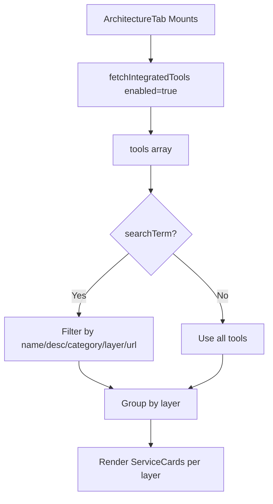

<!-- source-hash: a00d1d31cb4672db833eb018e1a49a81 -->
Renders the **Architecture Overview** tab, displaying all enabled integrated tools grouped by layer with search/filter capabilities and credential details.

## Key Components

**`ArchitectureTab`** — Main page component that:
- Fetches enabled integrated tools via `useIntegratedTools` on mount
- Provides a live search input filtering by name, description, category, layer, and URLs
- Groups filtered tools alphabetically by `layer`, rendering each group with a `ServiceCard`
- Shows skeleton placeholders during loading

**Props**

| Prop | Type | Default |
|------|------|---------|
| `title` | `string` | `'Architecture Overview'` |

**`ServiceCard` row construction** — For each tool, builds display rows from:
- Tool URLs (with optional port concatenation) — copyable + openable links
- Credentials: `username`, `password` (secret), `apiKey` (secret)

## Usage Example

```typescript
import { ArchitectureTab } from './architecture';

// Default usage inside a settings/architecture route
export default function ArchitecturePage() {
  return <ArchitectureTab />;
}

// With custom title
export default function ArchitecturePage() {
  return <ArchitectureTab title="My Stack Overview" />;
}
```

## Data Flow

