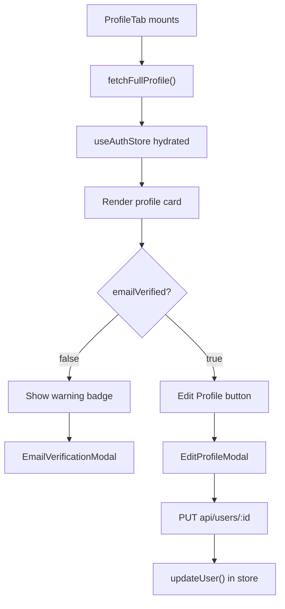

<!-- source-hash: ff7eefc3dfda181469aff1eadfb0c76a -->
Renders the user profile tab within account settings, displaying the current user's avatar, name, email, roles, and providing actions to edit profile details or trigger email verification.

## Key Components

- **`ProfileTab`** — Main exported component that orchestrates profile display and edit flows
- **`updateProfile`** — Memoized async handler that PUTs updated `firstName`/`lastName` to `api/users/:id` and syncs the auth store
- **`handleResendVerification`** — Sends a verification email via `authApiClient` and surfaces success/error toasts
- **`EditProfileModal`** — Modal for editing name and profile image
- **`EmailVerificationModal`** — Modal triggered when `emailVerified === false`, allowing the user to resend the verification email

## Usage Example

```typescript
// Rendered as a tab panel within an account/settings page
import { ProfileTab } from './tabs/profile';

export function AccountSettingsPage() {
  return (
    <Tabs defaultValue="profile">
      <TabsContent value="profile">
        <ProfileTab />
      </TabsContent>
    </Tabs>
  );
}
```

## State & Data Flow



> **Dependencies:** Requires `useAuthStore` to be populated before render. Displays a `Skeleton` while `isLoadingProfile` is true and renders `PageError` if no user data is available after loading.