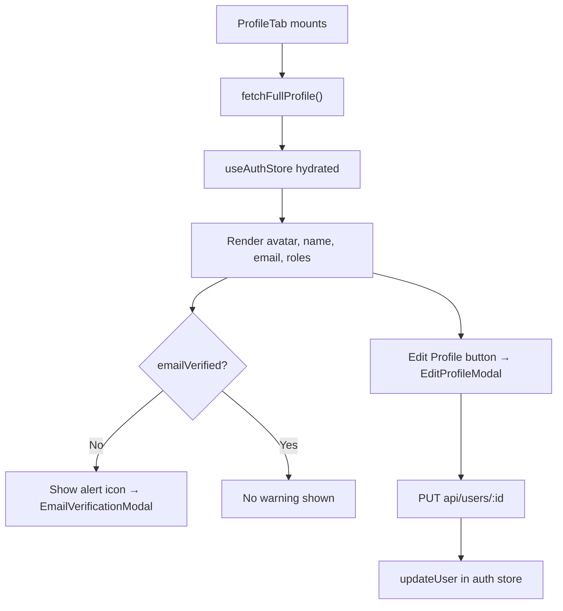

<!-- source-hash: ff7eefc3dfda181469aff1eadfb0c76a -->
Renders the user profile tab within account settings, displaying the current user's avatar, display name, email, and role badges, with support for editing profile details and triggering email verification.

## Key Components

- **`ProfileTab`** — Main exported component that orchestrates profile display and user actions
- **`updateProfile`** — Memoized callback that PUTs updated `firstName`/`lastName` to `api/users/:id` and syncs the auth store
- **`handleResendVerification`** — Sends a verification email via `authApiClient` and surfaces success/error via toast
- **`EditProfileModal`** — Modal for editing first/last name and profile image
- **`EmailVerificationModal`** — Modal triggered when `emailVerified === false`, allowing the user to resend the verification email

## Usage Example

```typescript
// Rendered as a tab panel inside the account settings page
import { ProfileTab } from './tabs/profile';

export function AccountSettingsPage() {
  return (
    <Tabs>
      <TabPanel value="profile">
        <ProfileTab />
      </TabPanel>
    </Tabs>
  );
}
```

## State & Data Flow



> **Loading state:** A full-width `Skeleton` is shown while `isLoadingProfile` is true and no cached user exists. If the store resolves with no user, a `PageError` is rendered instead.