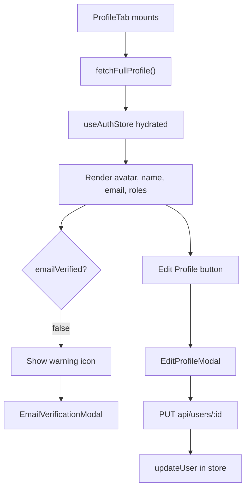

<!-- source-hash: ff7eefc3dfda181469aff1eadfb0c76a -->
Renders the user profile tab, displaying the authenticated user's avatar, display name, email, roles, and email verification status, with support for editing profile details and resending verification emails.

## Key Components

- **`ProfileTab`** — Main exported component that orchestrates profile display and user interactions
- **`updateProfile`** — Memoized async callback that PUTs updated `firstName`/`lastName` to `api/users/:id` and syncs the auth store
- **`handleResendVerification`** — Sends a verification email via `authApiClient` and surfaces success/error toasts
- **`EditProfileModal`** — Modal for editing first/last name and profile image
- **`EmailVerificationModal`** — Modal triggered when `emailVerified === false`, allowing the user to request a new verification email
- **`useAuthStore`** — Zustand store providing `user`, `isLoadingProfile`, `updateUser`, and `fetchFullProfile`

## Usage Example

```typescript
// Render the profile tab inside a settings page or tabbed layout
import { ProfileTab } from '@/components/settings/profile';

export default function SettingsPage() {
  return (
    <div className="max-w-2xl mx-auto">
      <ProfileTab />
    </div>
  );
}
```

## State & Data Flow

