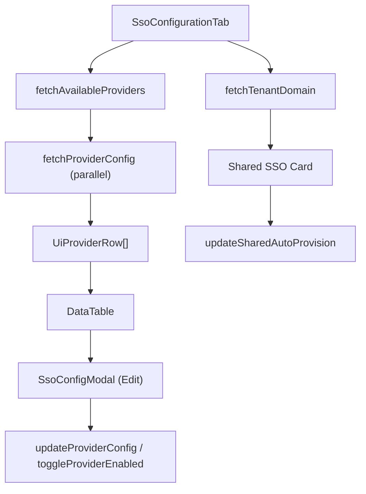

<!-- source-hash: ee09a311eec7489cc30688a9c6f9f9d8 -->
Renders the SSO Configuration tab for managing OAuth/SSO providers, including a searchable provider table with edit modals and a shared SSO auto-provisioning card for tenant domain accounts.

## Key Components

- **`SsoConfigurationTab`** — Main page component rendering the SSO provider list and shared SSO domain section
- **`UiProviderRow`** — Internal type representing a flattened SSO provider row for the data table
- **`loadData`** — Fetches available providers and their configs in parallel, maps them to UI rows
- **`loadDomainData`** — Loads tenant domain info to drive the shared SSO auto-provision card
- **`handleAutoProvisionToggle`** — Toggles auto-provisioning for shared Google/Microsoft SSO with optimistic local state update
- **`columns`** — Memoized `ColumnDef[]` defining Provider, Status, Allowed Domains, Configuration, and Actions columns
- **`SsoConfigModal`** — Edit modal opened per-row for updating provider credentials and settings

## Usage Example

```typescript
// Rendered as a tab within the settings page
import { SsoConfigurationTab } from './sso-configuration';

export default function SettingsPage() {
  return (
    <Tabs>
      <TabsContent value="sso">
        <SsoConfigurationTab />
      </TabsContent>
    </Tabs>
  );
}
```

## Data Flow

