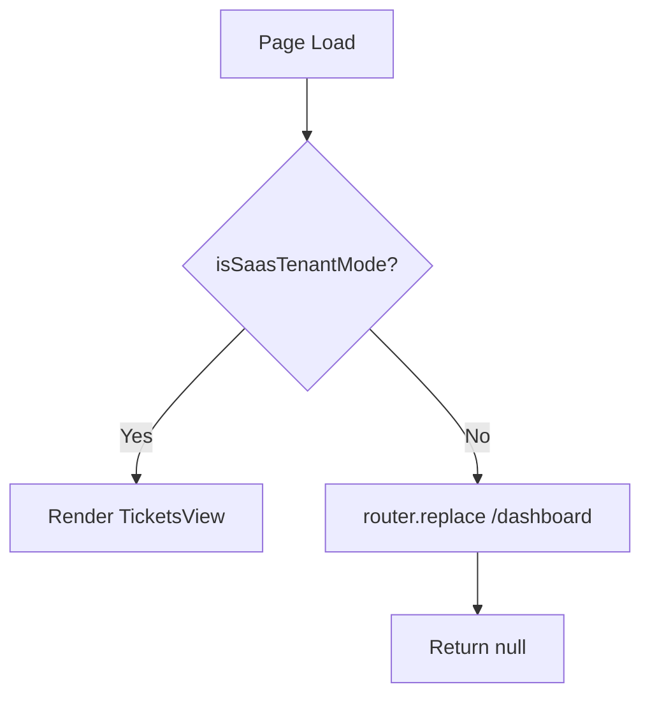

<!-- source-hash: 7058e95a21c4d8d6283f6a16987743ba -->
Client-side Next.js page component for the Tickets route. Restricts access to SaaS tenant mode only, redirecting non-SaaS users to the dashboard.

## Key Components

- **`Tickets`** — Default page export; guards rendering and navigation based on `isSaasTenantMode()`
- **`isSaasTenantMode()`** — Utility that determines if the app is running in SaaS tenant mode
- **`TicketsView`** — The actual tickets UI rendered when access is permitted
- **`dynamic = 'force-dynamic'`** — Disables static generation, ensuring the page is always server-rendered at request time

## Usage Example

```typescript
// Accessed via Next.js routing at /tickets
// Automatically redirects to /dashboard if not in SaaS tenant mode

// isSaasTenantMode() controls access:
if (!isSaasTenantMode()) {
  router.replace('/dashboard'); // redirect
  return null;                  // prevent render
}

// When in SaaS tenant mode:
return <TicketsView />;
```

## Behavior

