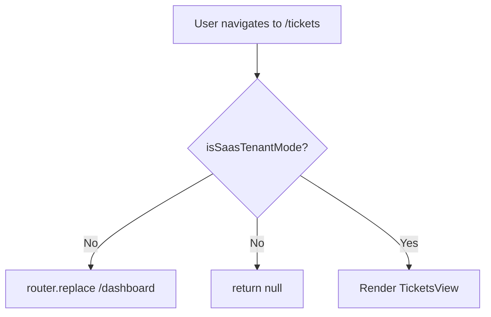

<!-- source-hash: 7058e95a21c4d8d6283f6a16987743ba -->
Client-side Next.js page component that guards access to the Tickets feature, restricting it exclusively to SaaS tenant mode and redirecting unauthorized access to the dashboard.

## Key Components

- **`Tickets` (default export)** — Page component that conditionally renders the tickets interface based on the current app mode
- **`isSaasTenantMode()`** — Utility check that determines if the app is running in SaaS tenant mode; redirects to `/dashboard` if not
- **`TicketsView`** — The core tickets UI component rendered when access is permitted
- **`dynamic = 'force-dynamic'`** — Disables static generation, ensuring the page is always server-rendered dynamically

## Usage Example

```typescript
// Accessed via Next.js routing at /tickets
// Automatically redirects to /dashboard if not in SaaS tenant mode

// app-mode utility (referenced internally)
import { isSaasTenantMode } from '@/lib/app-mode';

if (!isSaasTenantMode()) {
  // User is redirected to /dashboard
  // Component returns null to prevent flash of content
}
```

## Behavior Flow



> **Note:** The `null` render guard and `router.replace` work in tandem to prevent any flash of unauthorized content during the redirect.