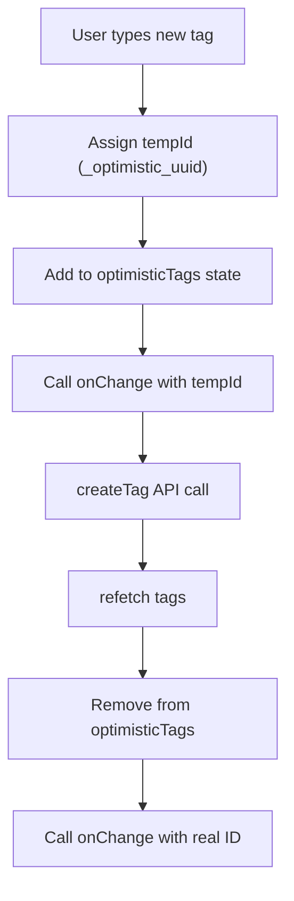

<!-- source-hash: e7c4f6caa134d973a4bcbf643ff92ccb -->
Manages ticket tag selection and creation within an autocomplete UI, supporting optimistic updates when new tags are created on-the-fly.

## Key Components

- **`TicketTagsManager`** — Main component that renders a multi-select autocomplete for ticket labels, handling both selection of existing tags and inline creation of new ones
- **`optimisticTags`** — Local state that holds temporary tag entries (prefixed `_optimistic_`) while the real tag is being persisted via API
- **`handleChange`** — Core logic that differentiates between selecting existing tags and creating new ones, triggering `createTag` and replacing temp IDs with real IDs on resolution
- **`useTicketLabels`** — Hook that fetches available ticket labels
- **`useCreateTagMutation`** — Hook that handles tag creation API calls with an `entityType` of `'TICKET'`

## Usage Example

```typescript
import { TicketTagsManager } from './ticket-tags-manager';

function TicketForm() {
  const [tagIds, setTagIds] = useState<string[]>([]);

  return (
    <TicketTagsManager
      selectedIds={tagIds}
      onChange={setTagIds}
      disabled={false}
    />
  );
}
```

## Optimistic Update Flow



> **Note:** If `createTag` returns no real ID, the optimistic entry is silently dropped after refetch to avoid stale state.