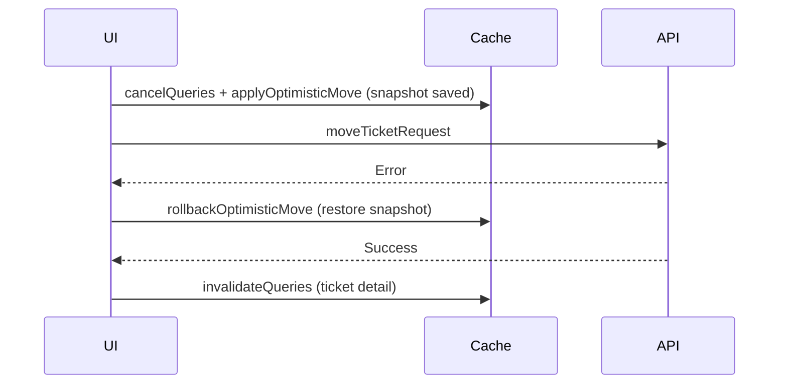

<!-- source-hash: e44c2630c864e8006fda61723a6133d9 -->
Provides a React hook for moving tickets between board columns with optimistic UI updates, rollback on failure, and tracking of in-flight move operations.

## Key Components

| Export | Type | Description |
|--------|------|-------------|
| `MoveTicketParams` | Interface | Parameters for a move: `ticketId`, `sourceStatus`, `targetStatus`, `afterTicketId`, `beforeTicketId` |
| `useMoveTicket` | Hook | `useMutation` wrapper that executes the move, applies optimistic updates, rolls back on error, and invalidates ticket detail cache on settle |
| `useMovingTicketIds` | Hook | Returns a `Set<string>` of ticket IDs currently being moved (pending mutations), useful for disabling drag handles or showing spinners |
| `moveTicketRequest` | Internal fn | Routes to `mutateStatus` (cross-column, no anchor) or `reorderTicket` (positional move, optionally cross-column) |

## Usage Example

```typescript
// Moving a ticket between columns (drag-and-drop handler)
const { mutate: moveTicket } = useMoveTicket();

moveTicket({
  ticketId: 'ticket-123',
  sourceStatus: 'open',
  targetStatus: 'in_progress',
  afterTicketId: 'ticket-456',
  beforeTicketId: null,
});

// Disabling drag on tickets currently being moved
const movingIds = useMovingTicketIds();

const isDraggable = !movingIds.has(ticket.id);
```

## Optimistic Update Behavior



> All concurrent move mutations share the scope `tickets-board-move`, serializing execution and preventing race conditions on the board cache.