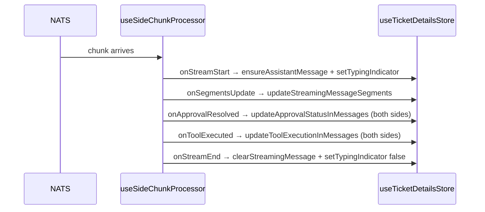

<!-- source-hash: 44c557766cc4b06f05f46081a35e1727 -->
Drives one chat side (client or admin) of a ticket dialog by wiring NATS real-time chunk processing to the `useTicketDetailsStore`, managing streaming message lifecycle, approval handling, and tool execution state.

## Key Components

- **`useSideChunkProcessor(side, options)`** — Primary hook export. Accepts a `ChatSide` (`'client'` | `'admin'`) and configuration options, returns a `processChunk` function ready to consume incoming NATS chunks.
- **`isInProgress(segments)`** — Internal utility that checks whether a message's segments contain any in-flight tool executions, pending approval requests, or unresolved approval batches.
- **`UseSideChunkProcessorOptions`** — Interface defining required assistant metadata (`assistantName`, `assistantType`) and optional callbacks for approval (`onApprove`, `onReject`), model metadata (`onMetadata`), and user display name.

## Usage Example

```typescript
const processChunk = useSideChunkProcessor('client', {
  assistantName: 'Mingo',
  assistantType: 'MINGO',
  userDisplayName: 'John Doe',
  onApprove: async (requestId) => {
    await approveToolExecution(requestId);
  },
  onReject: async (requestId) => {
    await rejectToolExecution(requestId);
  },
  onMetadata: ({ modelDisplayName, contextWindow }) => {
    console.log(`Using ${modelDisplayName} (${contextWindow} tokens)`);
  },
});

// Feed raw NATS chunks into the processor
natsSubscription.on('message', (chunk) => {
  processChunk(chunk);
});
```

## Callback Flow



> **Note:** Approval and tool execution state updates are always applied to **both** `client` and `admin` sides simultaneously, regardless of which side received the chunk.