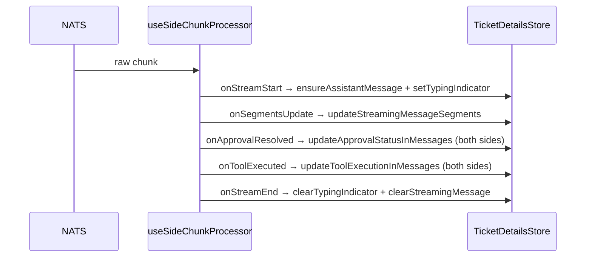

<!-- source-hash: 44c557766cc4b06f05f46081a35e1727 -->
Drives one chat side (client or admin) within a ticket dialog by processing real-time NATS message chunks and synchronizing the resulting state into the ticket details store.

## Key Components

- **`useSideChunkProcessor(side, options)`** — Primary hook export. Wires up stream callbacks, manages assistant message lifecycle, and returns a `processChunk` function for feeding raw NATS chunks into the UI state.
- **`isInProgress(segments)`** — Internal helper that determines whether a prior assistant message is still awaiting completion (executing tool, pending approval, or incomplete approval batch).
- **`UseSideChunkProcessorOptions`** — Configuration interface accepting assistant identity, display names, approval callbacks (`onApprove`/`onReject`), and a metadata callback for model info.
- **`incompleteState`** — Memoized reconstruction of any unfinished assistant message from history, allowing the accumulator to resume mid-stream after async history loads.

## Usage Example

```typescript
import { useSideChunkProcessor } from './use-side-chunk-processor';

function TicketChat() {
  const processChunk = useSideChunkProcessor('client', {
    assistantName: 'Mingo',
    assistantType: 'client',
    userDisplayName: 'Jane Doe',
    onApprove: async (requestId) => {
      await approveToolExecution(requestId);
    },
    onReject: async (requestId) => {
      await rejectToolExecution(requestId);
    },
    onMetadata: ({ modelDisplayName, contextWindow }) => {
      console.log(`Using ${modelDisplayName} (${contextWindow} tokens)`);
    },
  });

  // Feed raw NATS chunks into the processor
  natsSubscription.on('message', (chunk) => processChunk(chunk));
}
```

## Stream Callback Flow

