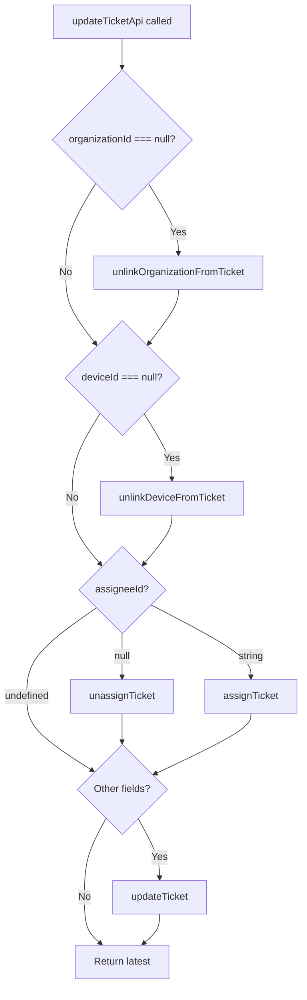

<!-- source-hash: 7ef9ddde268909579c0189a680327b86 -->
React Query mutation hook for updating tickets, handling assignment, device/organization linking, and field updates via sequential GraphQL mutations.

## Key Components

- **`runTicketMutation<K>`** — Generic helper that executes a GraphQL mutation via `apiClient`, extracts the response payload, and throws on `userErrors`.
- **`updateTicketApi`** — Orchestrates up to four sequential mutations based on the provided `UpdateTicketInput`: unlink organization, unlink device, unassign/assign technician, and general field updates.
- **`useUpdateTicket`** — Exported React Query mutation hook that wraps `updateTicketApi` with cache invalidation, success/error toasts, and post-update navigation.

## Usage Example

```typescript
import { useUpdateTicket } from '@/features/tickets/hooks/use-update-ticket';

function TicketForm({ ticket }) {
  const { mutate: updateTicket, isPending } = useUpdateTicket();

  const handleSubmit = (values) => {
    updateTicket({
      id: ticket.id,
      title: values.title,
      assigneeId: values.assigneeId ?? null, // null = unassign
      deviceId: values.deviceId ?? null,     // null = unlink
      organizationId: values.organizationId,
    });
  };

  return (
    <button onClick={handleSubmit} disabled={isPending}>
      {isPending ? 'Saving...' : 'Save Ticket'}
    </button>
  );
}
```

## Mutation Logic



> **Note:** `null` values explicitly trigger unlink/unassign mutations, while `string` values trigger assign/link mutations. Passing `undefined` skips that field entirely.