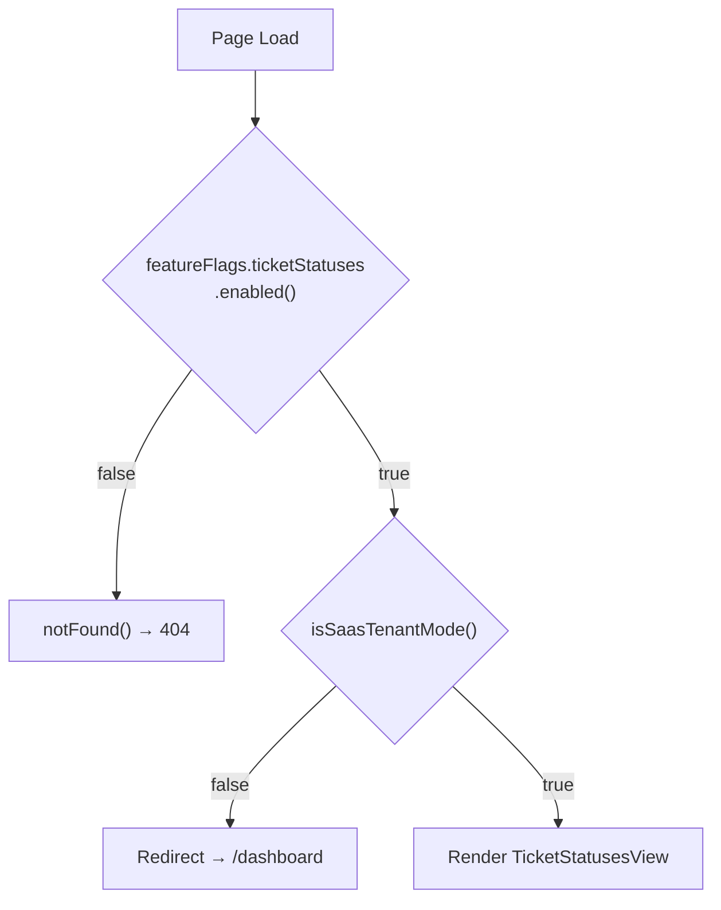

<!-- source-hash: d15157340f8e0d025ef2e6e2796bf61d -->
Client-side Next.js page component that renders the Ticket Statuses management view, gating access behind both a feature flag and SaaS tenant mode checks.

## Key Components

- **`TicketStatusesPage`** — Default exported page component that enforces two access conditions before rendering `TicketStatusesView`
- **`isSaasTenantMode()`** — Runtime check; redirects non-SaaS users to `/dashboard` via `useEffect`
- **`featureFlags.ticketStatuses.enabled()`** — Synchronous flag check; returns a 404 if the feature is disabled
- **`dynamic = 'force-dynamic'`** — Disables static generation, ensuring fresh evaluation on every request

## Usage Example

```typescript
// Automatically rendered by Next.js at the /ticket-statuses route.
// Access is restricted:
//   1. Feature flag must be enabled
//   2. App must be running in SaaS tenant mode

// Non-SaaS environments → redirect to /dashboard
// Disabled feature flag → 404 page
// Both conditions met → renders <TicketStatusesView />
```

## Access Control Flow

