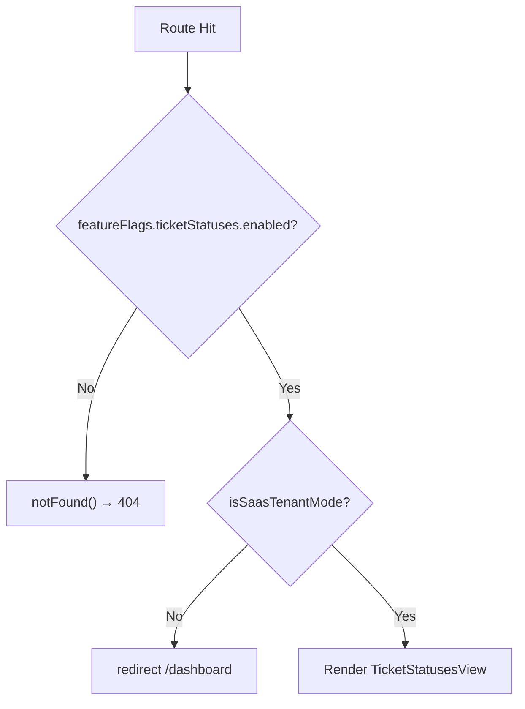

<!-- source-hash: d15157340f8e0d025ef2e6e2796bf61d -->
Page component that guards access to the Ticket Statuses configuration screen, redirecting non-SaaS-tenant users to the dashboard and returning a 404 when the `ticketStatuses` feature flag is disabled.

## Key Components

| Export | Type | Description |
|--------|------|-------------|
| `TicketStatusesPage` | `default` (React component) | Route page component with mode and feature-flag guards |
| `dynamic` | `const` | Set to `'force-dynamic'` to disable static generation for this route |

## Usage Example

This component is automatically rendered by Next.js when navigating to the ticket statuses route. No manual instantiation is needed.

```typescript
// Access control flow:
// 1. Feature flag disabled → notFound() (404)
// 2. Not SaaS tenant mode → redirect to /dashboard
// 3. Both checks pass → renders <TicketStatusesView />
```

**Guard logic summary:**



> **Note:** The `useEffect` redirect handles the client-side navigation case, while the synchronous `isSaasTenantMode()` check prevents a flash of the view before the redirect completes.