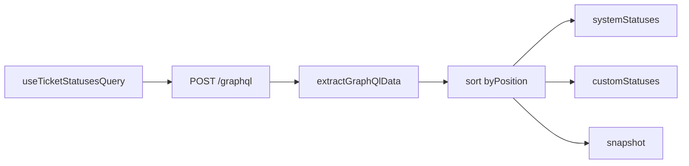

<!-- source-hash: 5e922e24c6be174d5f953986bc462b9b -->
Fetches and organizes ticket status definitions via GraphQL, separating results into system and custom statuses sorted by fractional-index position.

## Key Components

- **`TicketStatusesData`** — Return shape containing `systemStatuses`, `customStatuses`, and a raw `snapshot` array of all definitions
- **`byPosition`** — Bytewise comparator for fractional-index position strings (locale-unaware)
- **`useTicketStatusesQuery`** — React Query hook that POSTs `GET_TICKET_STATUSES_QUERY` to the GraphQL endpoint and returns sorted, split status lists

## Usage Example

```typescript
import { useTicketStatusesQuery } from './use-ticket-statuses-query';

function TicketStatusSelector() {
  const { data, isLoading } = useTicketStatusesQuery();

  if (isLoading) return <Spinner />;

  return (
    <>
      {data?.systemStatuses.map(s => <Tag key={s.id} label={s.name} />)}
      {data?.customStatuses.map(s => <Tag key={s.id} label={s.name} />)}
    </>
  );
}

// Conditionally disable fetching
const { data } = useTicketStatusesQuery({ enabled: isAuthenticated });
```

**Query key:** `ticketsQueryKeys.statuses()` — use this to invalidate or prefetch via `queryClient`.

**Data flow:**

