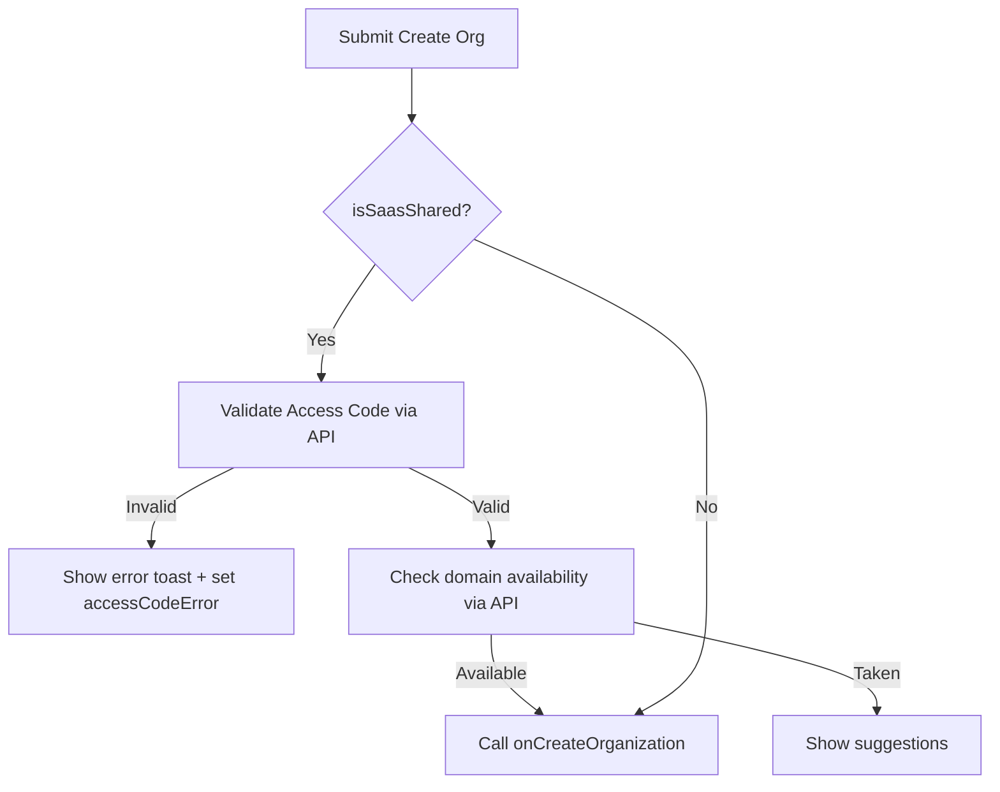

<!-- source-hash: 700da1e639e92f9b2e5b3e5b63cdbdd9 -->
A React client component that renders the authentication entry point UI, providing two flows: **Create Organization** (with optional SaaS shared mode domain/access-code validation) and **Sign In** (email-based).

## Key Components

### `AuthChoiceSection`
The default export. Accepts the following props:

| Prop | Type | Description |
|------|------|-------------|
| `onCreateOrganization` | `(orgName, domain, accessCode, email) => void` | Callback fired after all validations pass |
| `onSignIn` | `(email) => Promise<void>` | Async callback for the sign-in flow |
| `isLoading` | `boolean?` | Disables all inputs/buttons while a parent operation is in progress |

### Internal State

| State | Purpose |
|-------|---------|
| `orgName`, `domain`, `orgEmail` | Create org form fields |
| `signInEmail` | Sign-in form field |
| `accessCode` / `accessCodeError` | SaaS shared mode access code + validation error |
| `suggestedDomains` | Alternative subdomains shown when chosen domain is taken |
| `isCheckingDomain`, `isValidatingAccessCode`, `isSigningIn` | Per-action loading flags |

### Validation Flow (`handleCreateOrganization`)



### `ForgotPasswordModal`
Conditionally rendered when `showForgotPassword` is `true`. Triggered from the Sign In section.

## Usage Example

```typescript
import { AuthChoiceSection } from './choice-section';

export default function AuthPage() {
  const handleCreate = (orgName: string, domain: string, accessCode: string, email: string) => {
    console.log('Creating org:', { orgName, domain, accessCode, email });
  };

  const handleSignIn = async (email: string) => {
    await signInWithEmail(email);
  };

  return (
    <AuthChoiceSection
      onCreateOrganization={handleCreate}
      onSignIn={handleSignIn}
      isLoading={false}
    />
  );
}
```

> **SaaS Shared Mode:** When `isSaasSharedMode()` returns `true`, the component requires an **access code** and appends `SAAS_DOMAIN_SUFFIX` to the chosen subdomain before calling `onCreateOrganization`.