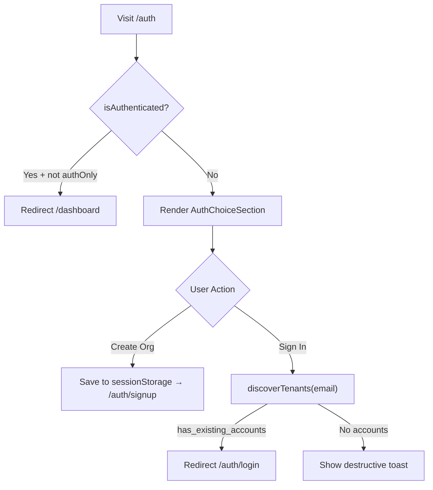

<!-- source-hash: 633bd68f23aaeb5e1e47708fe969ec9f -->
Entry point page component for the authentication flow, handling both sign-in and organization creation routing logic.

## Key Components

- **`AuthPage`** — Default export page component that orchestrates the auth entry experience
- **`useAuthStore`** — Reads `isAuthenticated` state to redirect already-authenticated users to `/dashboard`
- **`useAuth`** — Provides `discoverTenants` to check if an email has existing accounts
- **`handleCreateOrganization`** — Persists org details (`org_name`, `domain`, `access_code`, `email`) to `sessionStorage` and navigates to `/auth/signup/`
- **`handleSignIn`** — Calls `discoverTenants`; redirects to `/auth/login` on success or shows a destructive toast if no account is found
- **`isAuthOnlyMode`** — Guards the redirect, skipping the dashboard push when the app runs in auth-only mode

## Usage Example

```typescript
// Rendered automatically by Next.js at the /auth route.
// No manual instantiation needed — it maps to app/(auth)/auth/page.tsx

// sessionStorage keys written on org creation:
sessionStorage.getItem('auth:org_name');
sessionStorage.getItem('auth:domain');
sessionStorage.getItem('auth:access_code');
sessionStorage.getItem('auth:email');
```

## Flow Summary

