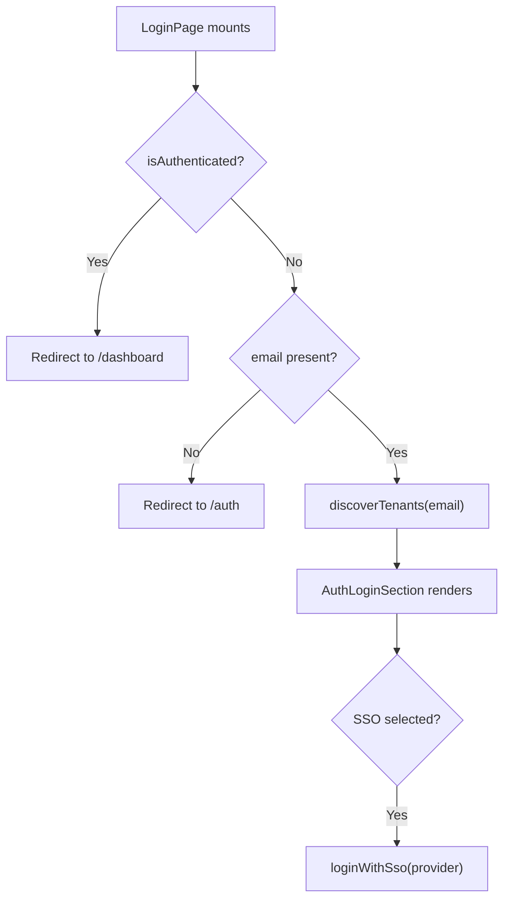

<!-- source-hash: dcb8d73a267a1eacf461c517e830d9e0 -->
Renders the login page for authenticated users, handling tenant discovery, SSO provider selection, and post-authentication redirection.

## Key Components

- **`LoginPage`** — Default export; a Next.js client component that orchestrates the login flow by consuming `useAuth` and `useAuthStore` hooks and rendering `AuthLoginSection` within `AuthLayout`.

**Key behaviors:**
- Redirects to `/dashboard` if already authenticated (unless in auth-only mode)
- Redirects to `/auth` if no email is present after initialization
- Triggers tenant discovery automatically when an email is available and discovery hasn't been attempted
- Delegates SSO login to `loginWithSso` from `useAuth`
- Uses `useSafeBack` for safe backward navigation to `/auth/`

## Usage Example

```typescript
// Rendered automatically by Next.js at the /auth/login route.
// No manual instantiation required.

// The page depends on prior state set in /auth (email collection step):
// - email must be present in auth state
// - tenant discovery is triggered automatically
// - available SSO providers are passed down to AuthLoginSection

// Redirects:
// - Unauthenticated + no email → /auth
// - Authenticated + not auth-only mode → /dashboard
```

## Data Flow

