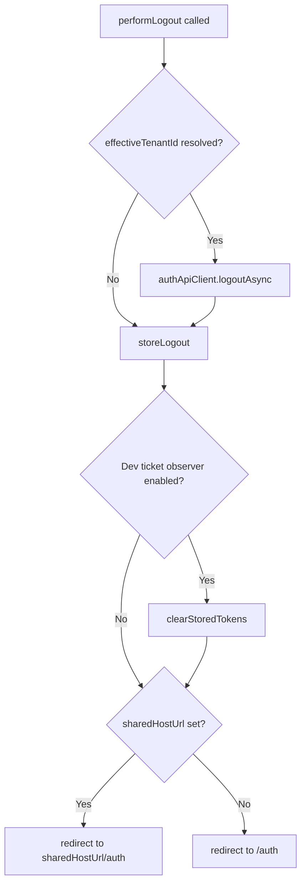

<!-- source-hash: 536013bafc0071ef3161277209f7fb2b -->
Provides a standalone logout action that can be invoked outside of the full `useAuth` hook, handling API logout, store cleanup, token clearing, and redirect logic.

## Key Components

- **`performLogout()`** — Async function that orchestrates the full logout flow: calls the auth API, clears the auth store state, optionally clears stored tokens (dev mode), and redirects to the appropriate auth page.

## Usage Example

```typescript
import { performLogout } from '@/features/auth/actions/auth-actions';

// In a component that only needs logout (e.g., AppShell nav button)
function LogoutButton() {
  return (
    <button onClick={performLogout}>
      Sign Out
    </button>
  );
}
```

## Logout Flow



## Notes

- Tenant ID is resolved from the store in priority order: `tenantId` → `user.tenantId` → `user.organizationId`
- Token clearing via `clearStoredTokens` only runs when `enableDevTicketObserver` is active
- Redirect target is driven by `runtimeEnv.sharedHostUrl()`, supporting multi-tenant shared host deployments