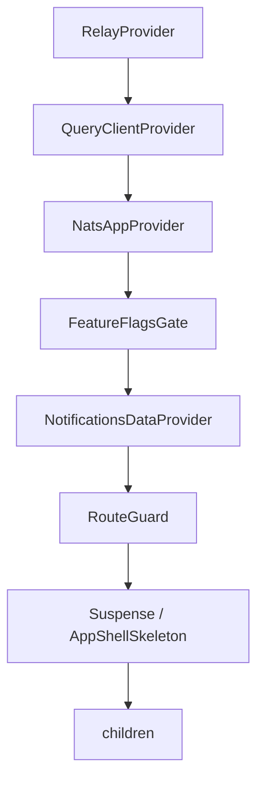

<!-- source-hash: d57cbc9297b2f9d11d1337e9bfb5a5cc -->
Root Next.js layout component that wraps the entire OpenFrame application, configuring global metadata, fonts, providers, and the app shell structure.

## Key Components

| Export | Type | Description |
|--------|------|-------------|
| `dynamic` | `'force-dynamic'` | Disables SSG across all routes to prevent `useSearchParams` issues |
| `metadata` | `Metadata` | Full SEO config — title templates, Open Graph, Twitter cards, favicons, and web manifest |
| `RootLayout` | React Component | Root layout wrapping all pages with the full provider tree |

## Provider Tree (inside-out)



## Usage Example

This layout is automatically applied by Next.js App Router to all routes. No manual usage is required.

```typescript
// next.js auto-resolves app/layout.tsx as the root layout
// children = any page.tsx in the app/ directory

export default function Page() {
  return <div>My Page Content</div>;
}
```

## Notes

- **Fonts:** `azeretMono` and `dmSans` are injected as CSS variables via `className` on `<html>`.
- **Dark mode:** `dark` class is hardcoded on `<html>`; theme color is set to `#161616` (ODS background token).
- **Auth guard:** `DevTicketObserver` and `GraphQlIntrospectionInitializer` only mount when `isAuthEnabled()` returns `true`.
- **Environment:** `PublicEnvScript` from `next-runtime-env` exposes public env vars at runtime (no build-time baking).
- **Analytics:** `GoogleTagManager` renders as a side-effect component with no visible output.