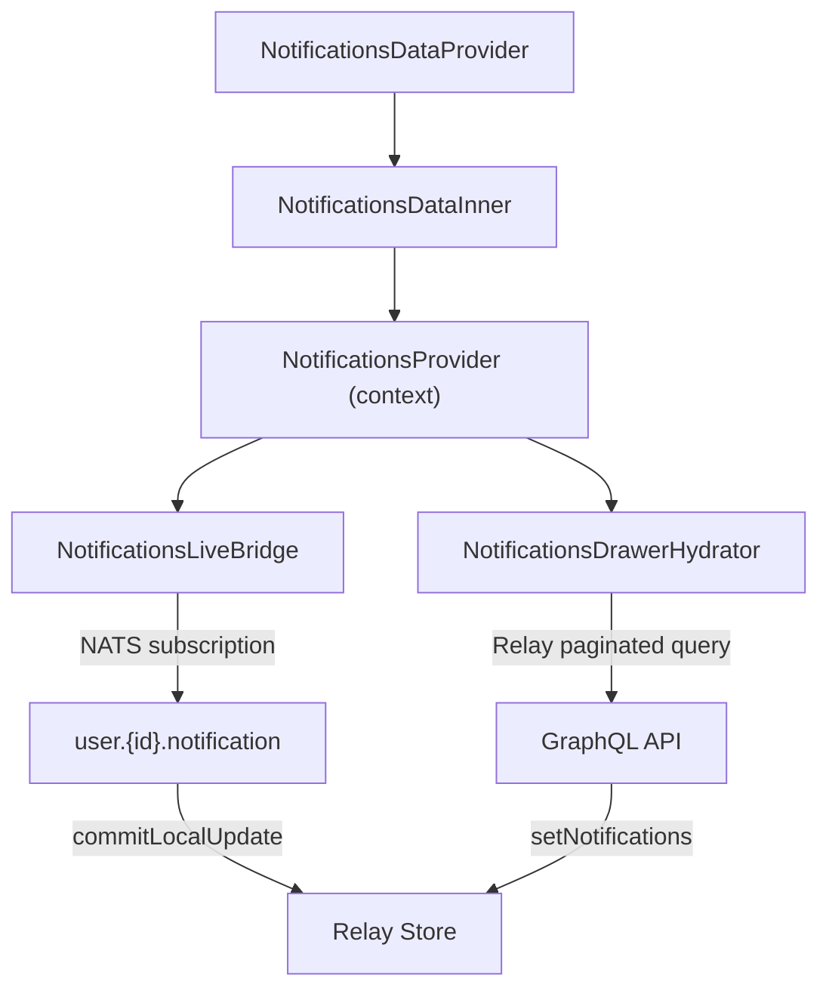

<!-- source-hash: f6631b678acf0327e3dba9b423e5694b -->
React provider that wires together the notifications system: loads paginated notification history via Relay GraphQL, streams live updates via NATS, and exposes the unified notifications context (popups, drawer, actions) to the app.

## Key Components

| Export/Component | Description |
|---|---|
| `NotificationsDataProvider` | Public entry point; reads auth state and feature flags, gates notifications on authentication |
| `NotificationsDataInner` | Composes `NotificationsProvider` with pagination state and mutation actions |
| `NotificationsDrawerHydrator` | Relay-powered component that fetches and paginates historical notifications, syncs them into context |
| `NotificationsLiveBridge` | Subscribes to a user-scoped NATS subject and prepends incoming notifications to the Relay store in real time |

## Usage Example

```typescript
// Wrap your app layout with the provider (typically in a root layout or shell)
import { NotificationsDataProvider } from './notifications-data-provider';

export default function AppShell({ children }: { children: React.ReactNode }) {
  return (
    <RelayEnvironmentProvider environment={relayEnv}>
      <NotificationsDataProvider>
        {children}
      </NotificationsDataProvider>
    </RelayEnvironmentProvider>
  );
}
```

## Data Flow



## Key Behaviors

- **Feature-gated**: Notifications are disabled entirely when `featureFlags.notifications.enabled()` returns `false` or the user is unauthenticated
- **Popup persistence**: Show/hide popup preference is persisted to `localStorage` under `of.notifications:showPopups`
- **Deduplication**: `NotificationsLiveBridge` checks existing Relay connection edges before prepending to prevent duplicate entries
- **Pagination**: Drawer loads 30 notifications per page; `loadMore` is surfaced to `NotificationsProvider` for consumer-driven pagination