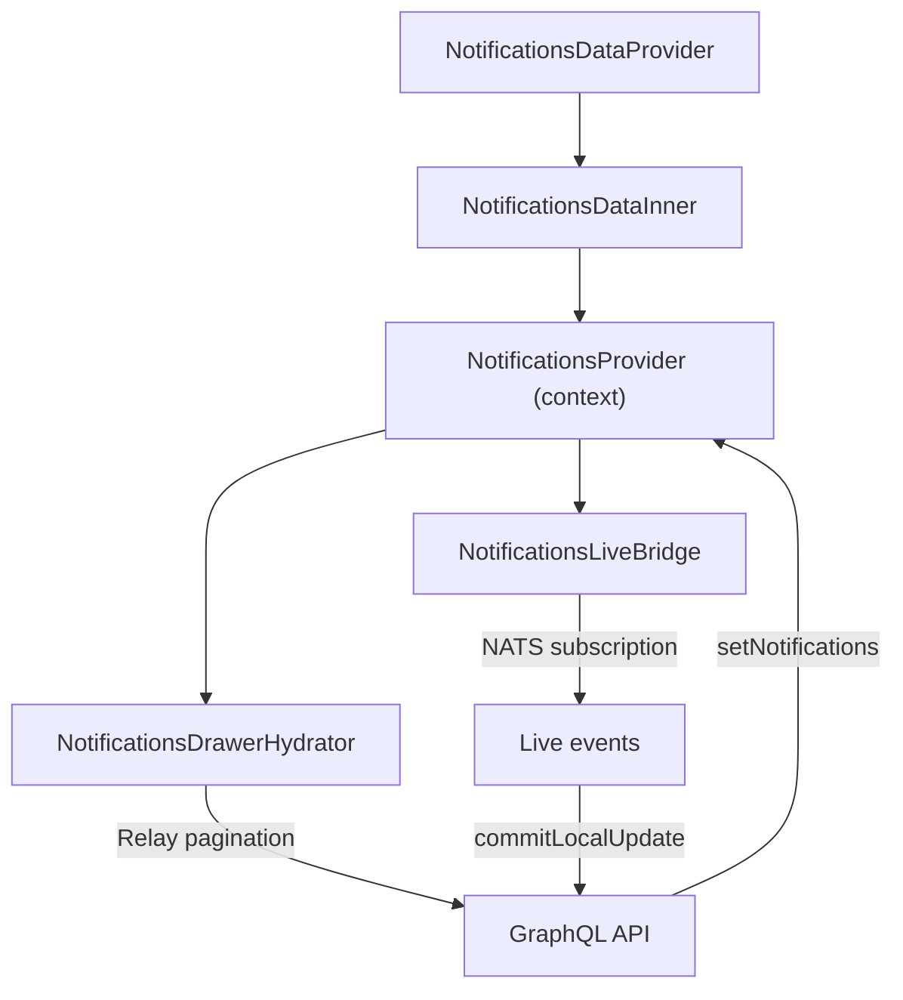

<!-- source-hash: f6631b678acf0327e3dba9b423e5694b -->
Provides the real-time notifications data layer for the OpenFrame frontend, wiring together Relay GraphQL pagination, NATS live subscriptions, and the shared `NotificationsProvider` context.

## Key Components

| Export / Component | Role |
|--------------------|------|
| `NotificationsDataProvider` | Public root component; reads auth state and feature flags, delegates to inner tree |
| `NotificationsDataInner` | Composes `NotificationsProvider` with actions, pagination state, and popup toggle |
| `NotificationsDrawerHydrator` | Relay-powered component that loads paginated notifications and syncs them into context via `setNotifications` |
| `NotificationsLiveBridge` | NATS subscriber that prepends incoming notifications directly into the Relay store (dedup-safe) |

## Usage Example

```typescript
// Wrap your app layout to enable notifications
import { NotificationsDataProvider } from './notifications-data-provider';

export default function RootLayout({ children }: { children: React.ReactNode }) {
  return (
    <RelayEnvironmentProvider environment={relayEnv}>
      <NotificationsDataProvider>
        {children}
      </NotificationsDataProvider>
    </RelayEnvironmentProvider>
  );
}
```

## Data Flow



**Key behaviors:**
- Popup visibility is persisted to `localStorage` via `of.notifications:showPopups`
- Live payloads are deduplicated before insertion into the Relay connection
- The entire notification tree is gated behind both `featureFlags.notifications.enabled()` and authenticated session state