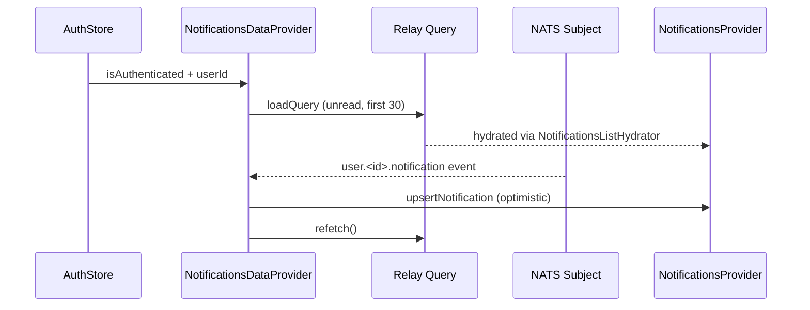

<!-- source-hash: 4295274dc7fe264a5c24cfcd3d1e1791 -->
Bootstraps the notifications feature for the OpenFrame frontend by wiring together GraphQL data loading, NATS real-time events, and the `NotificationsProvider` context in a single client component tree.

## Key Components

| Export / Component | Description |
|---|---|
| `NotificationsDataProvider` | Root provider component. Loads the initial notifications query via Relay, gates all behavior behind the `featureFlags.notifications` flag, and persists popup preferences to `localStorage`. |
| `NotificationsLiveBridge` | Internal component that subscribes to a per-user NATS subject (`user.<userId>.notification`) and calls `upsertNotification` for optimistic UI updates, then triggers a refetch. |
| `NatsNotificationPayload` | Interface describing the raw NATS message shape, including optional `id`/`notificationId`, `severity`, `title`, `description`, `createdAt`, and `context`. |
| `DRAWER_FILTER_PAIRS` | Filter configuration forwarded to `useNotificationMutations` for mark-read / remove operations. |

## Usage Example

```typescript
// app/layout.tsx
import { NotificationsDataProvider } from '@/components/notifications/notifications-data-provider';

export default function RootLayout({ children }: { children: React.ReactNode }) {
  return (
    <RelayEnvironmentProvider environment={relayEnv}>
      <NotificationsDataProvider>
        {children}
      </NotificationsDataProvider>
    </RelayEnvironmentProvider>
  );
}
```

## Data Flow



> **Note:** When `featureFlags.notifications.enabled()` returns `false`, the Relay query is disposed, the NATS bridge is not mounted, and `NotificationsProvider` receives no `actions` — effectively a no-op wrapper.