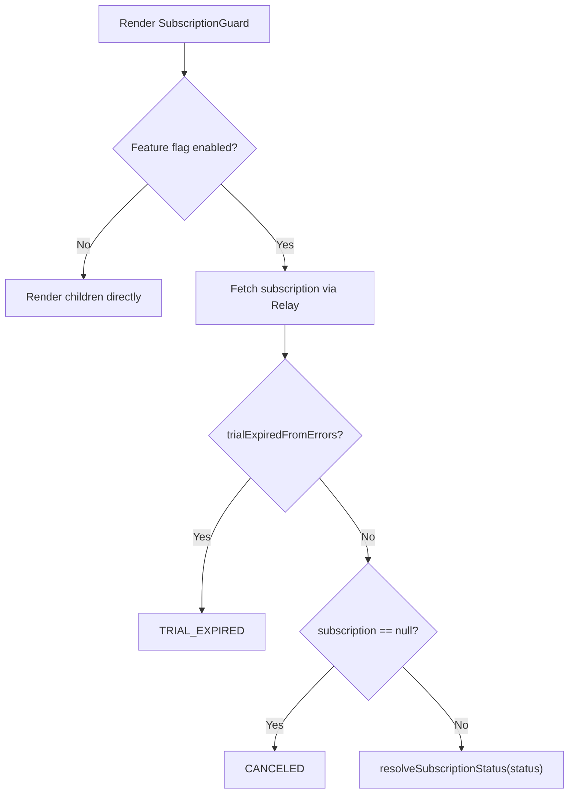

<!-- source-hash: 8d7a1788de48bbd842b8eb2518a53084 -->
Resolves the current subscription status at the app boundary and distributes it via context, enabling downstream components to react to lock state without triggering redirect races.

## Key Components

- **`SubscriptionGuard`** — Public wrapper component. Short-circuits rendering when the `subscription` feature flag is disabled; otherwise wraps the inner loader in `Suspense`.
- **`SubscriptionGuardInner`** — Fetches subscription data via Relay's `useLazyLoadQuery` (`store-or-network`) and computes the resolved status, feeding it into `SubscriptionLockProvider`.
- **`resolveGuardStatus`** — Pure helper that determines the final `SubscriptionStatus` by prioritizing error-driven trial expiry signals over API-returned subscription state.
- **`subscriptionGuardQuery`** — GraphQL query fetching `subscription { id, status }`.

## Usage Example

```typescript
// Wrap your AppShell or root layout with SubscriptionGuard.
// AppShell then reads lock state from context to swap content — no redirects.
import { SubscriptionGuard } from '@/components/subscription-guard';

export default function RootLayout({ children }: { children: ReactNode }) {
  return (
    <SubscriptionGuard fallback={<LoadingSpinner />}>
      <AppShell>{children}</AppShell>
    </SubscriptionGuard>
  );
}
```

## Status Resolution Priority



> **Design note:** This component intentionally avoids redirects. Lock-state UI swaps are handled by `AppShell` reading from `SubscriptionLockProvider`, keeping rendering synchronous and race-free.