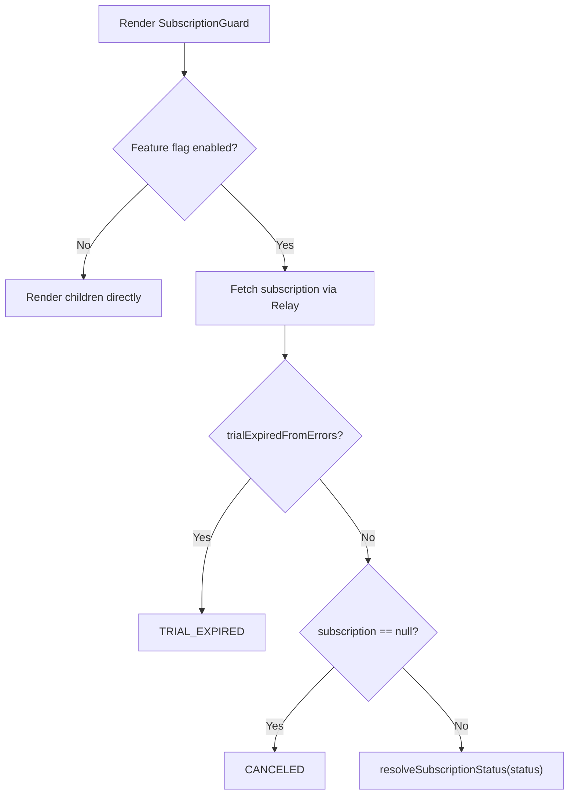

<!-- source-hash: 8d7a1788de48bbd842b8eb2518a53084 -->
Resolves and provides subscription status to the React component tree via context, gating feature access based on the current subscription state.

## Key Components

- **`SubscriptionGuard`** — Public wrapper component that short-circuits if the subscription feature flag is disabled, otherwise renders an inner resolver inside a `Suspense` boundary
- **`SubscriptionGuardInner`** — Fires the `subscriptionGuardQuery` GraphQL query via Relay's `useLazyLoadQuery` and combines the result with error-derived lock signals to compute the final status
- **`resolveGuardStatus`** — Pure function that maps subscription data + `trialExpiredFromErrors` signal to a `SubscriptionStatus` enum value, prioritizing error signals over API state
- **`subscriptionGuardQuery`** — Relay GraphQL query fetching `subscription { id status }`

## Usage Example

```typescript
// Wrap your app shell or route layout to propagate subscription context
import { SubscriptionGuard } from '@/components/subscription/subscription-guard';

export default function RootLayout({ children }: { children: React.ReactNode }) {
  return (
    <SubscriptionGuard fallback={<LoadingSpinner />}>
      {children}
    </SubscriptionGuard>
  );
}
```

> **Design note:** `SubscriptionGuard` intentionally avoids redirecting — lock-state UI swaps are handled by `AppShell` reading from `SubscriptionLockProvider`, keeping rendering synchronous and preventing redirect races.

## Status Resolution Priority

