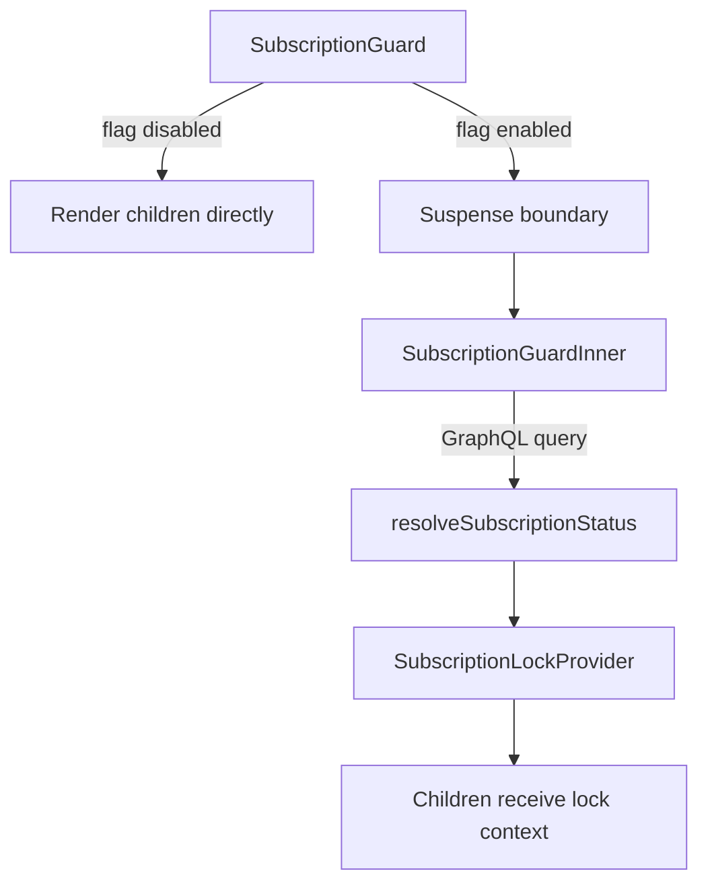

<!-- source-hash: 4297c00303ee2432821d1aa835d4fb63 -->
Resolves the current subscription status via a GraphQL query and provides it to the app through context, enabling subscription-aware rendering without redirects.

## Key Components

| Export | Type | Description |
|--------|------|-------------|
| `SubscriptionGuard` | Component | Outer guard that checks feature flags and wraps children in `Suspense` |
| `SubscriptionGuardInner` | Component (internal) | Executes the GraphQL query and populates `SubscriptionLockProvider` with resolved status |
| `subscriptionGuardQuery` | GraphQL query | Fetches `id` and `status` from the `subscription` root field |

## Behavior Notes

- **Feature flag bypass** — if `featureFlags.subscription.enabled()` returns `false`, children render directly with no query or context overhead.
- **No redirects** — intentionally avoids navigation side effects. Lock state is consumed by `AppShell`, keeping rendering synchronous and race-free.
- **Fetch policy** — uses `store-or-network` to avoid redundant network requests when subscription data is already cached.

## Usage Example

```typescript
// Wrap your app shell or layout root
import { SubscriptionGuard } from '@/components/subscription-guard';

export default function Layout({ children }: { children: ReactNode }) {
  return (
    <SubscriptionGuard fallback={<LoadingSpinner />}>
      {children}
    </SubscriptionGuard>
  );
}
```

## Data Flow

