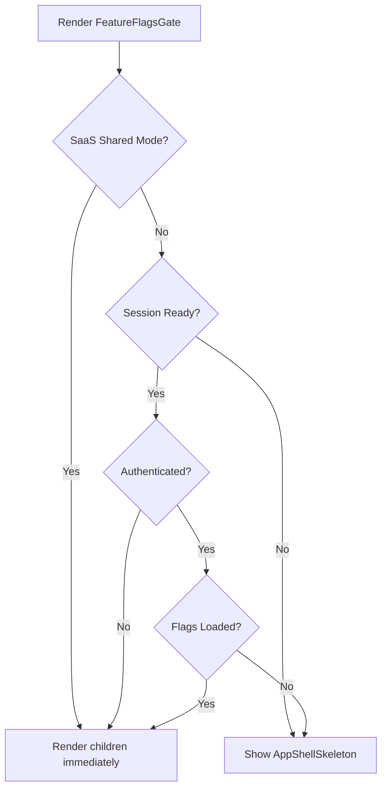

<!-- source-hash: 27556dad30cf6240ae7f759d6062f984 -->
A React gate component that controls rendering of child components until feature flags are loaded, handling both SaaS shared mode and authenticated user scenarios.

## Key Components

- **`FeatureFlagsGate`** — Wrapper component that blocks rendering until feature flags are initialized
- **`useFeatureFlagsQuery`** — Fetches feature flags from the server; only enabled when not in SaaS shared mode and the session is ready and authenticated
- **`useFeatureFlagsStore`** — Zustand store tracking load state (`isLoaded`, `setLoaded`)
- **`AppShellSkeleton`** — Loading UI shown while flags are being fetched

## Behavior Logic



## Usage Example

```typescript
// Wrap your app layout to ensure feature flags are available before rendering
export default function RootLayout({ children }: { children: React.ReactNode }) {
  return (
    <FeatureFlagsGate>
      {children}
    </FeatureFlagsGate>
  );
}
```

## Key Behaviors

- **SaaS shared mode**: Bypasses flag fetching entirely and marks flags as loaded immediately
- **Unauthenticated users**: Marks flags as loaded without fetching (no auth = no user-specific flags needed)
- **Authenticated users**: Fetches flags from the server and blocks rendering until complete, showing `AppShellSkeleton` in the interim