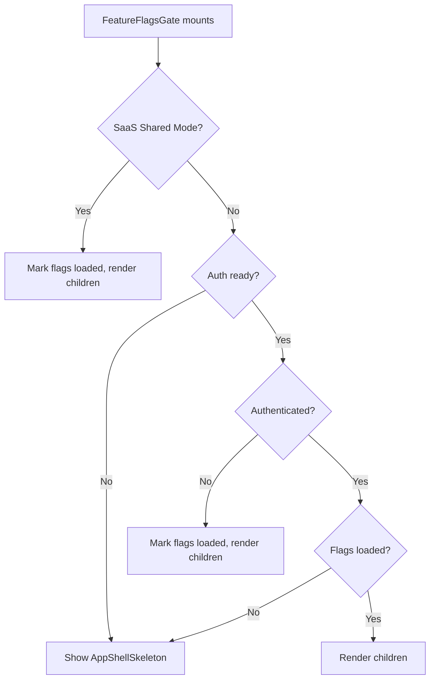

<!-- source-hash: 27556dad30cf6240ae7f759d6062f984 -->
A client-side gate component that controls rendering until feature flags are resolved, showing a skeleton loader while flags are being fetched for authenticated sessions.

## Key Components

- **`FeatureFlagsGate`** — Wrapper component that conditionally renders children or an `AppShellSkeleton` based on feature flag load state
- **`isSaasSharedMode`** — Utility used to bypass flag fetching in SaaS shared mode
- **`useFeatureFlagsQuery`** — Hook that fetches feature flags; only enabled when authenticated and not in SaaS shared mode
- **`useFeatureFlagsStore`** — Zustand store tracking whether flags have been loaded (`isLoaded`, `setLoaded`)

## Rendering Logic



## Usage Example

```typescript
// Wrap your app shell or layout to ensure feature flags are available before rendering
import { FeatureFlagsGate } from '@/app/components/feature-flags-gate';

export default function RootLayout({ children }: { children: React.ReactNode }) {
  return (
    <FeatureFlagsGate>
      {children}
    </FeatureFlagsGate>
  );
}
```

> In SaaS shared mode or unauthenticated sessions, the gate immediately marks flags as loaded and passes children through, skipping the fetch entirely.