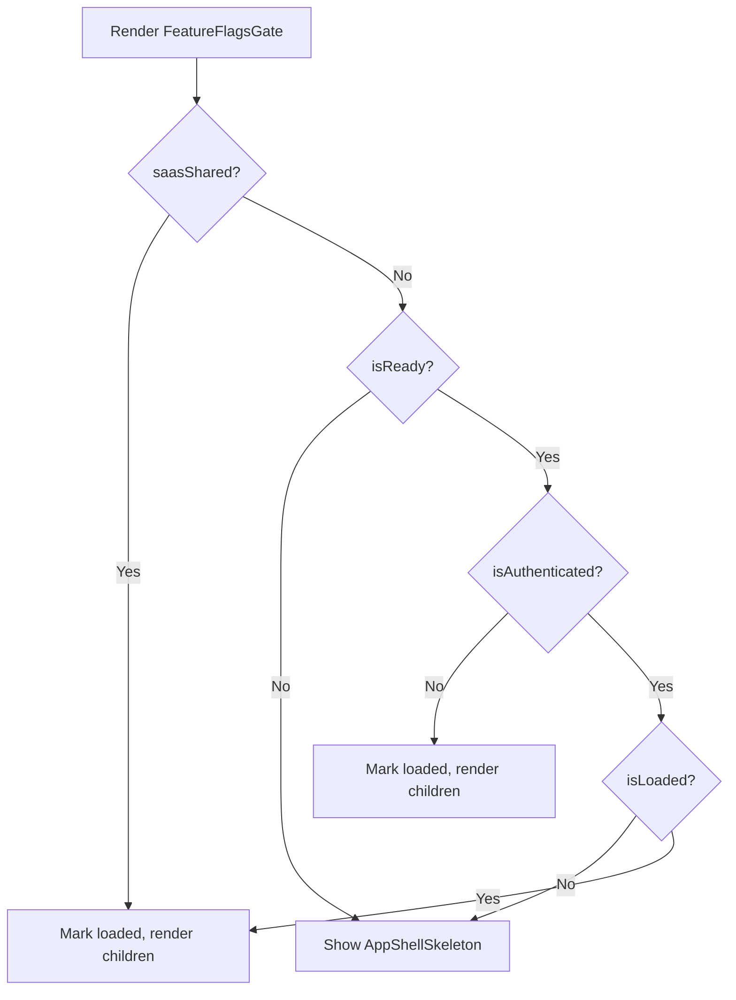

<!-- source-hash: 27556dad30cf6240ae7f759d6062f984 -->
A client-side gate component that blocks rendering until feature flags are fully loaded, displaying a skeleton UI in the interim.

## Key Components

- **`FeatureFlagsGate`** — Wrapper component that conditionally renders children or a loading skeleton based on auth state and feature flag load status
- **`useFeatureFlagsQuery`** — Fetches feature flags from the server; only enabled when auth is ready, user is authenticated, and not in SaaS shared mode
- **`useFeatureFlagsStore`** — Zustand store tracking whether flags have been loaded (`isLoaded`, `setLoaded`)
- **`isSaasSharedMode`** — Bypasses flag fetching and marks flags as loaded immediately in shared/public SaaS contexts

## Behavior Logic



## Usage Example

```typescript
// Wrap app shell or layout to ensure flags are available before rendering
export default function Layout({ children }: { children: React.ReactNode }) {
  return (
    <FeatureFlagsGate>
      {children}
    </FeatureFlagsGate>
  );
}
```

> **Note:** In SaaS shared mode, the gate passes through immediately without fetching flags. For unauthenticated users, it also skips the fetch and marks flags as loaded to avoid blocking the login flow.