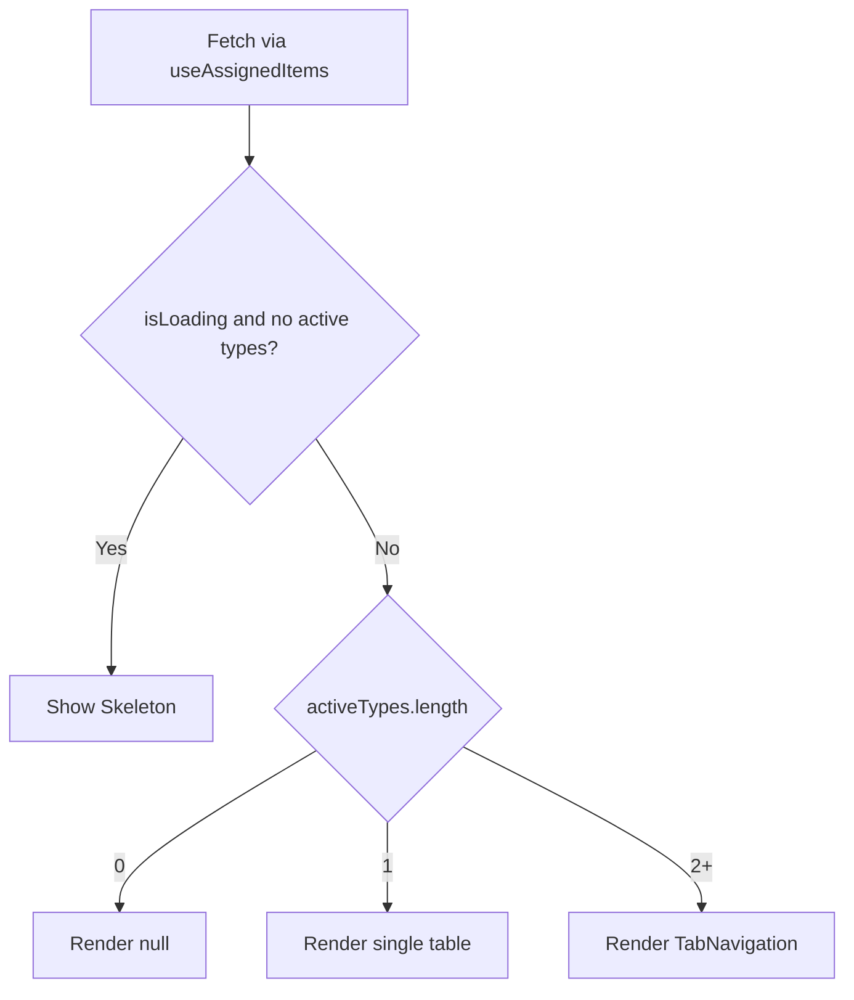

<!-- source-hash: e96ce8e62459b44cb591f2806c0b5339 -->
Renders a tabbed view of items assigned to a given entity, displaying customers, devices, knowledge base articles, or tickets in separate tabs based on what data is available.

## Key Components

### `AssignedItemsViewProps`
| Prop | Type | Description |
|------|------|-------------|
| `itemId` | `string` | ID of the entity whose assigned items are displayed |
| `itemType` | `AssignmentItemType` | Type of the parent entity (e.g. user, role) |
| `className` | `string?` | Optional CSS class for the section wrapper |

### `AssignedItemsView`
Main exported component. Fetches assigned items via `useAssignedItems`, filters to only non-empty target types, and renders:
- A **skeleton loader** while data is loading and no tabs are available yet
- `null` if no assigned items exist
- A **single table** (no tabs) when only one target type has data
- A **`TabNavigation`** with pinned tab state when multiple target types are present

## Usage Example

```typescript
import { AssignedItemsView } from './assigned-items-view';

function UserDetailPage({ userId }: { userId: string }) {
  return (
    <AssignedItemsView
      itemId={userId}
      itemType="USER"
      className="mt-6"
    />
  );
}
```

## Rendering Logic

