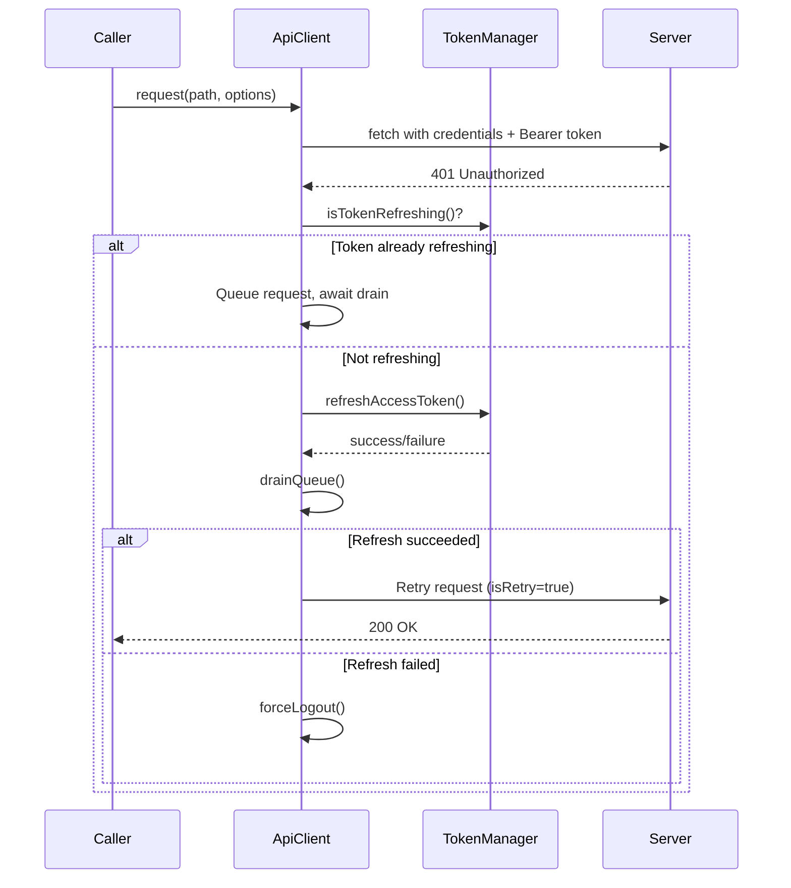

<!-- source-hash: 71fe0e845e7a2324aee4fb8eef40a476 -->
Centralized HTTP client that handles authenticated API requests with automatic token refresh, cookie-based and header-based auth support, and request queuing during token refresh cycles.

## Key Components

| Export | Type | Description |
|--------|------|-------------|
| `apiClient` | Singleton | Pre-configured `ApiClient` instance for app-wide use |
| `ApiClient` | Class | Core client class with auth and retry logic |
| `ApiResponse<T>` | Interface | Typed response wrapper with `data`, `error`, `status`, `ok` |
| `ApiRequestOptions` | Interface | Extended `RequestInit` with `skipAuth` flag support |

### `ApiClient` Methods

| Method | Description |
|--------|-------------|
| `request<T>()` | Base method — handles auth headers, 401 retry, queue drain |
| `get / post / put / patch / delete` | Convenience wrappers around `request()` |
| `external<T>()` | Bypasses base URL resolution for third-party endpoints |
| `me<T>()` | Shorthand for `GET /api/me` |

## Usage Example

```typescript
import { apiClient } from './api-client';

// Basic GET
const { data, error, ok } = await apiClient.get<User>('/api/users/me');

// POST with body
const result = await apiClient.post<Ticket>('/api/tickets', {
  title: 'Network issue',
  priority: 'high',
});

// Skip auth for public endpoints
const pub = await apiClient.get('/api/health', { skipAuth: true });

// External (non-base) URL
const ext = await apiClient.external('https://third-party.api/data');

// Manual abort
const controller = new AbortController();
const res = await apiClient.get('/api/slow', { signal: controller.signal });
controller.abort(); // Returns { error: 'Request aborted', status: 0, ok: false }
```

## Auth Flow

