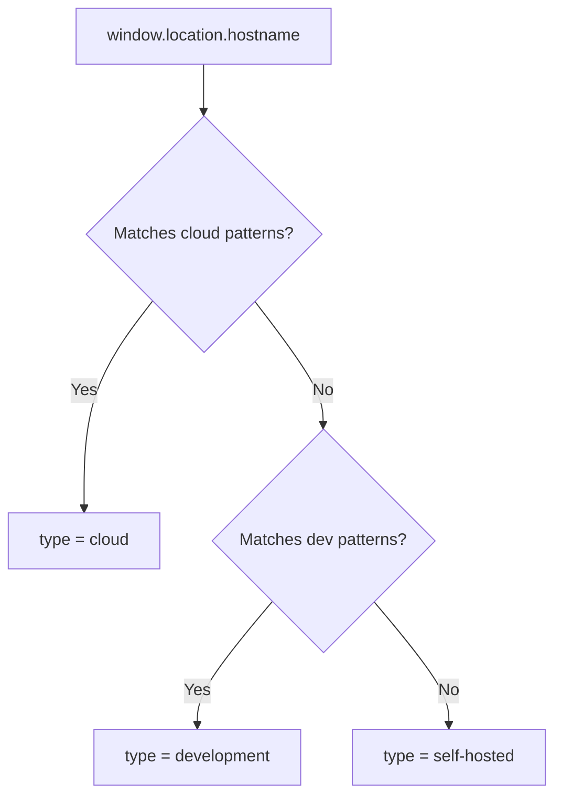

<!-- source-hash: a421e63a98987df7b77542063348903e -->
Detects and classifies the current deployment environment (cloud, self-hosted, or development) based on hostname patterns, enabling conditional logic across the OpenFrame platform.

## Key Components

| Export | Type | Description |
|--------|------|-------------|
| `DeploymentType` | Type | Union type: `'self-hosted' \| 'cloud' \| 'development'` |
| `DeploymentInfo` | Interface | Full deployment context including flags and hostname |
| `detectDeployment()` | Function | Primary resolver — returns full `DeploymentInfo` object |
| `isCloud()` | Function | Quick boolean check for cloud environment |
| `isSelfHosted()` | Function | Quick boolean check for self-hosted environment |
| `isDevelopment()` | Function | Quick boolean check for local/dev environment |
| `getDeploymentType()` | Function | Returns the raw `DeploymentType` string |

## Detection Logic



**Cloud patterns:** `openframe.ai`, `auth.openframe.ai`, `app.openframe`
**Dev patterns:** `localhost`, `127.0.0.1`, `0.0.0.0`, `.local`
**Self-hosted:** any other custom domain (default fallback)

## Usage Example

```typescript
import {
  detectDeployment,
  isCloud,
  isSelfHosted,
  getDeploymentType,
} from './deployment-detector';

// Full context
const deployment = detectDeployment();
console.log(deployment.type);     // 'cloud' | 'self-hosted' | 'development'
console.log(deployment.hostname); // e.g. 'app.openframe.ai'

// Feature flag gating
if (isCloud()) {
  enableCloudBilling();
}

if (isSelfHosted()) {
  showSelfHostedLicensePrompt();
}

// Switch-based routing
switch (getDeploymentType()) {
  case 'cloud':       return CloudAuthProvider;
  case 'self-hosted': return LocalAuthProvider;
  case 'development': return DevAuthProvider;
}
```

> **Note:** Falls back to `'localhost'` in SSR/non-browser environments where `window` is unavailable, ensuring safe server-side usage without runtime errors.