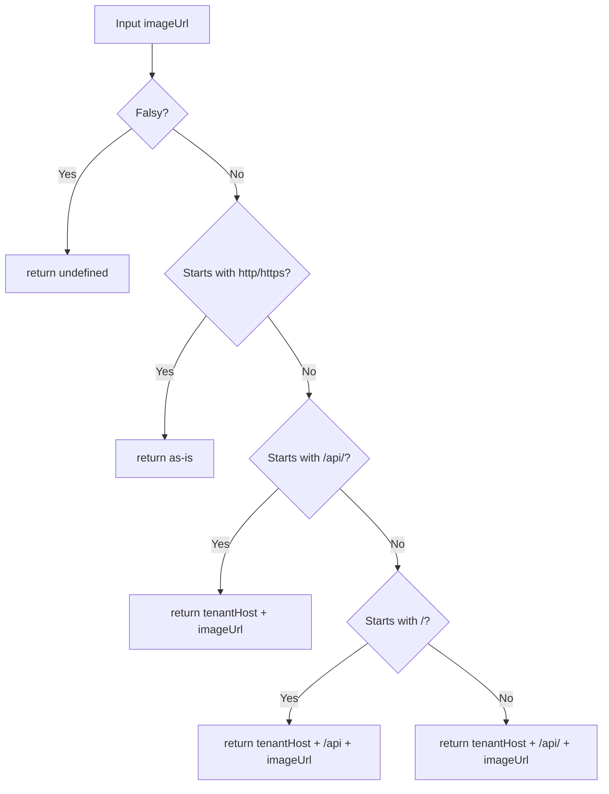

<!-- source-hash: 0f1577204837917c65c08004eb63fbe3 -->
Resolves relative or absolute image URLs to fully-qualified URLs by prepending the tenant host and `/api/` prefix as needed.

## Key Components

- **`getFullImageUrl(imageUrl)`** — Exported function that normalizes an image URL to a full URL using the configured tenant host from `runtimeEnv`.

## URL Resolution Logic



## Usage Example

```typescript
import { getFullImageUrl } from './image-url';

// Absolute URL — returned as-is
getFullImageUrl('https://cdn.example.com/photo.png');
// → 'https://cdn.example.com/photo.png'

// Already has /api/ prefix
getFullImageUrl('/api/uploads/avatar.jpg');
// → 'https://tenant.flamingo.run/api/uploads/avatar.jpg'

// Relative path with leading slash
getFullImageUrl('/uploads/avatar.jpg');
// → 'https://tenant.flamingo.run/api/uploads/avatar.jpg'

// Relative path without leading slash
getFullImageUrl('uploads/avatar.jpg');
// → 'https://tenant.flamingo.run/api/uploads/avatar.jpg'

// Null / undefined — returns undefined
getFullImageUrl(null);   // → undefined
getFullImageUrl(undefined); // → undefined
```

## Dependencies

| Import | Purpose |
|--------|---------|
| `runtimeEnv.tenantHostUrl()` | Provides the base tenant host URL at runtime |