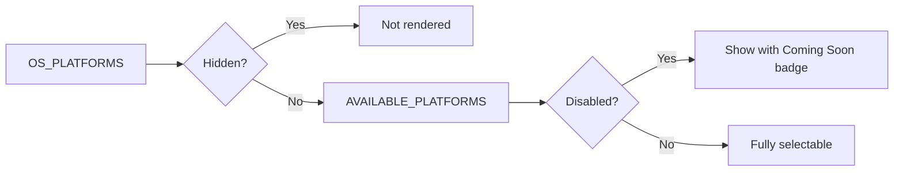

<!-- source-hash: 5447095ab72b6dbd53fe317e0eb2b385 -->
Filters and categorizes OS platforms for UI display by separating hidden, disabled, and available platform states.

## Key Components

| Export | Type | Description |
|--------|------|-------------|
| `DISABLED_PLATFORMS` | `OSPlatformId[]` | Platforms visible but not selectable, shown with a "Coming Soon" badge |
| `AVAILABLE_PLATFORMS` | `OSPlatformId[]` | Filtered list of `OS_PLATFORMS` excluding any hidden platforms (currently hides `linux`) |

`HIDDEN_PLATFORMS` is an internal constant (not exported) that defines platforms completely removed from the UI.

## Usage Example

```typescript
import { AVAILABLE_PLATFORMS, DISABLED_PLATFORMS } from './platforms';

// Render platform selector options
AVAILABLE_PLATFORMS.forEach(platform => {
  const isDisabled = DISABLED_PLATFORMS.includes(platform.id);
  renderPlatformOption(platform, { badge: isDisabled ? 'Coming Soon' : undefined });
});
```

## Platform States

