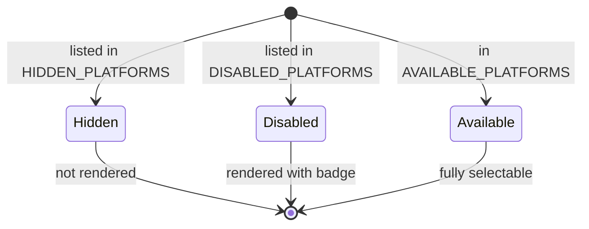

<!-- source-hash: 5447095ab72b6dbd53fe317e0eb2b385 -->
Filters and categorizes OS platforms for UI display, controlling which platforms are visible, selectable, or hidden in the OpenFrame frontend.

## Key Components

| Export | Type | Description |
|--------|------|-------------|
| `HIDDEN_PLATFORMS` | `OSPlatformId[]` | Internal list of platforms completely excluded from the UI (e.g., `linux`) |
| `DISABLED_PLATFORMS` | `OSPlatformId[]` | Platforms rendered with a "Coming Soon" badge but not selectable |
| `AVAILABLE_PLATFORMS` | `OSPlatform[]` | Filtered subset of `OS_PLATFORMS` excluding any hidden platform IDs |

## Usage Example

```typescript
import {
  AVAILABLE_PLATFORMS,
  DISABLED_PLATFORMS,
} from './platforms';

// Render platform selector
AVAILABLE_PLATFORMS.forEach(platform => {
  const isDisabled = DISABLED_PLATFORMS.includes(platform.id);

  renderPlatformOption({
    platform,
    badge: isDisabled ? 'Coming Soon' : undefined,
    selectable: !isDisabled,
  });
});
```

## Platform States

