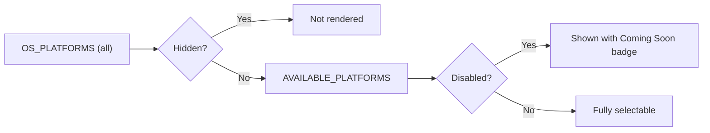

<!-- source-hash: 5447095ab72b6dbd53fe317e0eb2b385 -->
Filters and categorizes OS platforms for UI display by separating hidden, disabled, and available platforms from the full `OS_PLATFORMS` list.

## Key Components

| Export | Type | Description |
|--------|------|-------------|
| `DISABLED_PLATFORMS` | `OSPlatformId[]` | Platforms visible but not selectable (rendered with a "Coming Soon" badge) |
| `AVAILABLE_PLATFORMS` | `OSPlatformId[]` | Platforms shown in the UI, derived by excluding `HIDDEN_PLATFORMS` from `OS_PLATFORMS` |
| `HIDDEN_PLATFORMS` *(internal)* | `OSPlatformId[]` | Platforms fully hidden from the UI (currently `linux`) |

## Usage Example

```typescript
import { AVAILABLE_PLATFORMS, DISABLED_PLATFORMS } from './platforms';

// Render platform selector options
AVAILABLE_PLATFORMS.forEach(platform => {
  const isDisabled = DISABLED_PLATFORMS.includes(platform.id);

  renderPlatformOption({
    platform,
    badge: isDisabled ? 'Coming Soon' : undefined,
    selectable: !isDisabled,
  });
});
```

## Platform States



> To hide a platform entirely, add its `OSPlatformId` to `HIDDEN_PLATFORMS`. To show it as coming soon without making it selectable, add it to `DISABLED_PLATFORMS` instead.