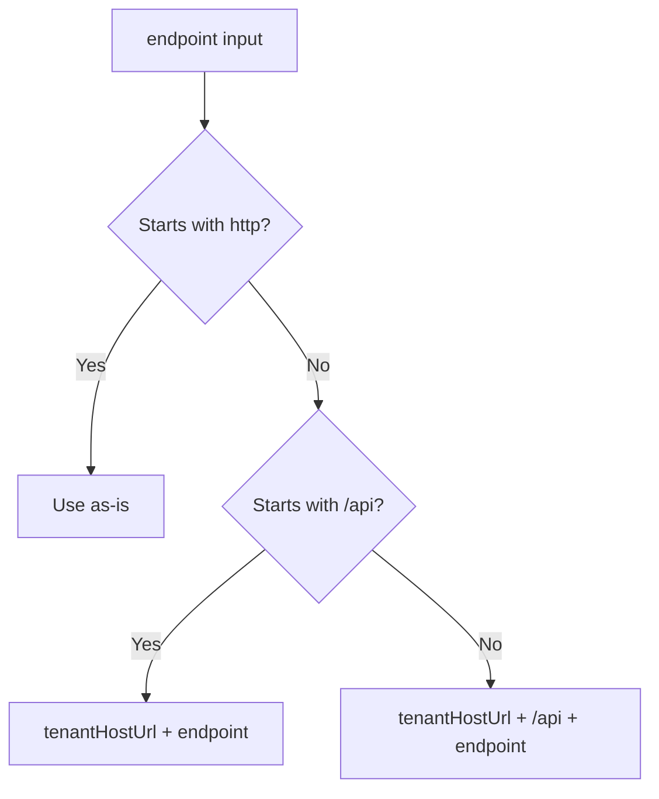

<!-- source-hash: 2db520c291d4b7804cf5b3b3ad642cb6 -->
Provides authenticated file upload and delete utilities for the OpenFrame platform, handling cookie-based auth with optional Bearer token injection and flexible endpoint URL resolution.

## Key Components

| Export | Type | Description |
|--------|------|-------------|
| `uploadWithAuth` | `async function` | POSTs a file via `multipart/form-data` with auth credentials, returns the uploaded file URL |
| `deleteWithAuth` | `async function` | Sends an authenticated DELETE request to a given endpoint |
| `useAuthenticatedUpload` | React hook | Wraps `uploadWithAuth` with `isUploading` and `error` state management |

## URL Resolution

Endpoints are resolved in this order:



## Auth Strategy

When `enableDevTicketObserver()` is active, a Bearer token is read from `localStorage` key `of_access_token` and injected as an `Authorization` header. All requests also include `credentials: 'include'` for cookie-based session auth.

## Usage Example

```typescript
// Standalone upload
const fileUrl = await uploadWithAuth('/uploads/avatar', file, 'avatar');

// Standalone delete
await deleteWithAuth('/uploads/avatar/123');

// React hook
function AvatarUploader() {
  const { upload, isUploading, error } = useAuthenticatedUpload();

  const handleChange = async (e: React.ChangeEvent<HTMLInputElement>) => {
    const file = e.target.files?.[0];
    if (!file) return;
    const url = await upload('/uploads/avatar', file, 'avatar');
    if (url) console.log('Uploaded to:', url);
  };

  return (
    <>
      <input type="file" onChange={handleChange} disabled={isUploading} />
      {error && <p>{error}</p>}
    </>
  );
}
```

## Response URL Detection

`uploadWithAuth` checks multiple response shape patterns for the returned URL:

```text
data.url
data.imageUrl
data.file_url
data.data.url
data.data.imageUrl
data.image.imageUrl
```