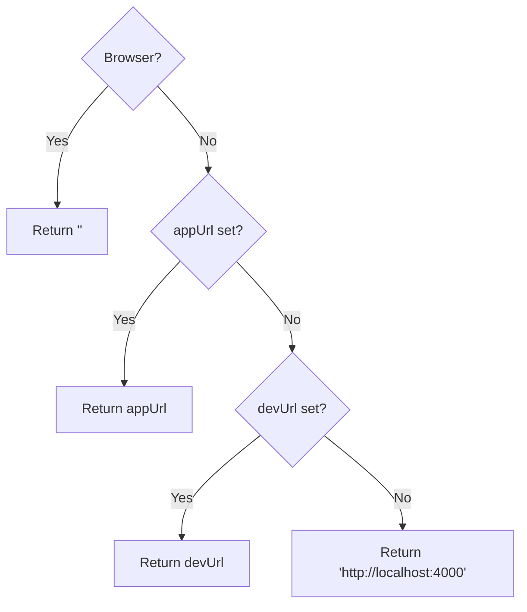

<!-- source-hash: 11b17fb064e07445d3d3a4b944bfc5c3 -->
Utility functions for the OpenFrame frontend, providing base URL resolution and asset URL generation across browser and server-side rendering contexts.

## Key Components

| Export | Type | Description |
|--------|------|-------------|
| `getBaseUrl()` | `() => string` | Resolves the application base URL based on runtime environment |
| `getAssetUrl(path)` | `(string) => string` | Generates an absolute URL for a given asset path |

## Usage Example

```typescript
import { getBaseUrl, getAssetUrl } from './utils';

// Resolves to '' in browser, or configured/fallback URL server-side
const base = getBaseUrl();
// e.g. '' | 'https://app.flamingo.run' | 'http://localhost:4000'

// Safely builds absolute asset URLs
const logo = getAssetUrl('images/logo.png');
// → '/images/logo.png' (browser)
// → 'https://app.flamingo.run/images/logo.png' (server)
```

## Resolution Order

`getBaseUrl()` follows this priority chain:



> Both `appUrl` and `devUrl` are sourced from `runtimeEnv` (see `runtime-config`), allowing deployment-time URL injection without a rebuild.