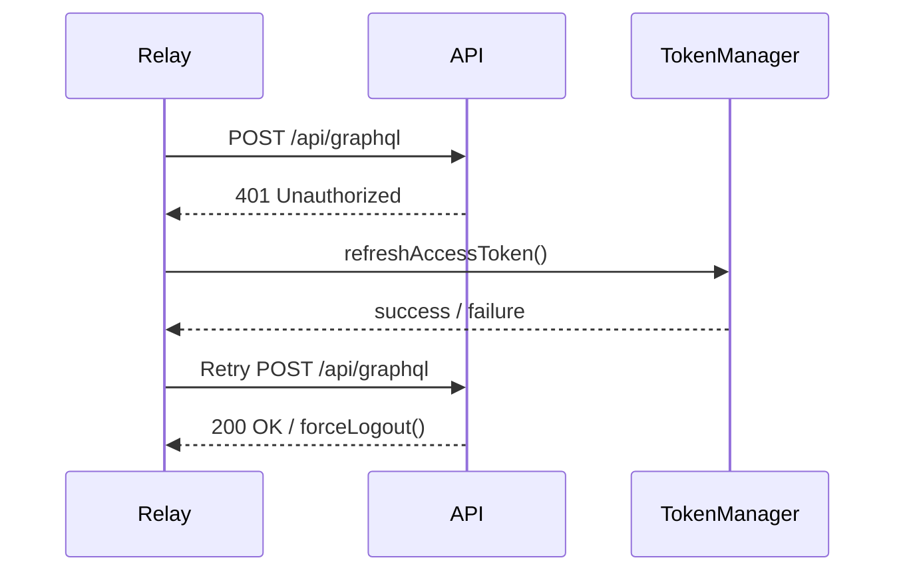

<!-- source-hash: 58cf60eec9eb22d514af9f8e5c8e948b -->
Configures and manages the singleton Relay GraphQL environment, including network fetch with cookie-based auth, 401 token refresh handling, and force logout fallback.

## Key Components

| Export | Type | Description |
|--------|------|-------------|
| `getRelayEnvironment()` | `function` | Returns (or creates) the singleton `IEnvironment`. Always creates a fresh instance on the server (SSR). On the client, applies GC buffer and query cache settings. |
| `resetRelayEnvironment()` | `function` | Nullifies the singleton — call on logout or auth state changes to force re-initialization. |
| `fetchRelay` | `FetchFunction` | Internal Relay network handler. Posts to `/api/graphql`, handles 401 with token refresh (waits if a refresh is already in-flight), and falls back to `forceLogout` if refresh fails. |
| `getAuthHeaders()` | `function` | Injects `Authorization: Bearer <token>` from `localStorage` when `enableDevTicketObserver` is active (dev/ticket observer mode only). |
| `getGraphqlUrl()` | `function` | Resolves the GraphQL endpoint from tenant host config or `window.location.origin`. |

## Usage Example

```typescript
import { getRelayEnvironment, resetRelayEnvironment } from './environment';

// Bootstrap Relay provider
const environment = getRelayEnvironment();

// In your root component
<RelayEnvironmentProvider environment={environment}>
  <App />
</RelayEnvironmentProvider>

// On logout — clears cached records and forces fresh auth
resetRelayEnvironment();
```

## Auth Flow

