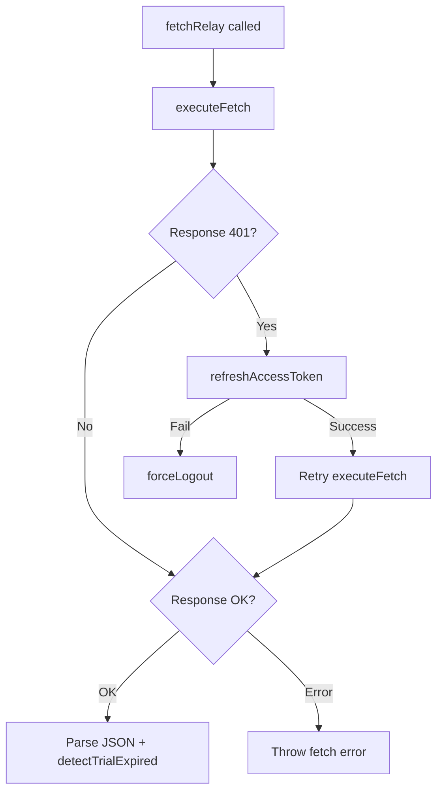

<!-- source-hash: 184f523e5960b57ad30bcc5d9fcdea2d -->
Configures and manages the singleton Relay GraphQL environment for client-side data fetching, including authentication, token refresh, and error handling.

## Key Components

- **`getAuthHeaders()`** — Builds authorization headers using a Bearer token from `localStorage` when dev ticket observer mode is enabled
- **`getGraphqlUrl()`** — Resolves the GraphQL endpoint URL from tenant config or `window.location.origin`
- **`fetchRelay`** — Core Relay `FetchFunction` that handles cookie-based auth, 401 token refresh with single retry, force logout on failure, and trial expiry detection from GraphQL errors
- **`getRelayEnvironment()`** — Returns the singleton `IEnvironment` (client) or a fresh SSR environment (server); configures the store with a 20-entry GC buffer and 5-minute query cache
- **`resetRelayEnvironment()`** — Clears the singleton, used on logout or auth state changes

## Usage Example

```typescript
import { getRelayEnvironment, resetRelayEnvironment } from './environment';

// Initialize or reuse the Relay environment
const environment = getRelayEnvironment();

// Pass to a Relay provider
<RelayEnvironmentProvider environment={environment}>
  <App />
</RelayEnvironmentProvider>

// On logout, reset cached environment
await logout();
resetRelayEnvironment();
```

## Auth Flow

