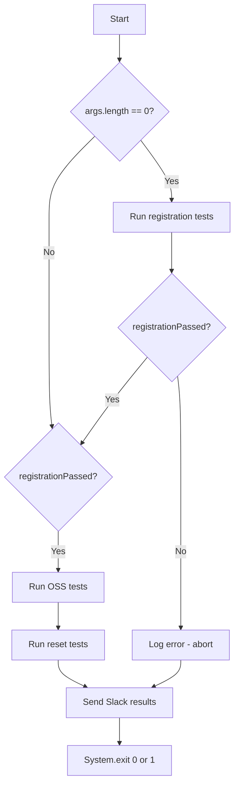

<!-- source-hash: 9eaf0683aaca1611d2848f8c2515cfda -->
Entry point for the OpenFrame automated test suite, orchestrating sequential test execution across registration, OSS, and reset phases with Allure reporting and Slack notifications.

## Key Components

| Component | Description |
|-----------|-------------|
| `TestRunner` | Executes JUnit Platform test plans based on provided configuration |
| `TestRunnerConfig` | Builder-pattern config holding the test package path and registered listeners |
| `AllureJunitPlatform` | Allure listener that generates rich HTML test reports |
| `SummaryGeneratingListener` | JUnit listener that collects pass/fail summary statistics |
| `SlackClient` | HTTP client for posting results to a Slack channel via OAuth token |
| `SlackListener` | JUnit listener that buffers results and sends a final Slack notification |
| `SummaryLogger` | Utility for logging test lists and summaries to stdout |

## Execution Flow



## Usage Example

```bash
# Run full suite (registration → oss → reset)
java -jar openframe-tests.jar

# Skip registration phase
java -jar openframe-tests.jar --skip-registration
```

```java
// Configuring the runner manually (mirrors main() setup)
TestRunnerConfig config = TestRunnerConfig.builder()
        .testPackage("com.openframe.test.tests")
        .testListeners(allureListener, summaryListener, slackListener)
        .build();

TestRunner runner = new TestRunner(config);
TestPlan plan = runner.discover("registration");
runner.run(plan);
```

> **Environment variable required:** `SLACK_OAUTH_TOKEN` must be set before launch; the Slack channel ID is hardcoded to `C0AHS6C6G3H`. The process exits with code `0` on full success and `1` on any failure.