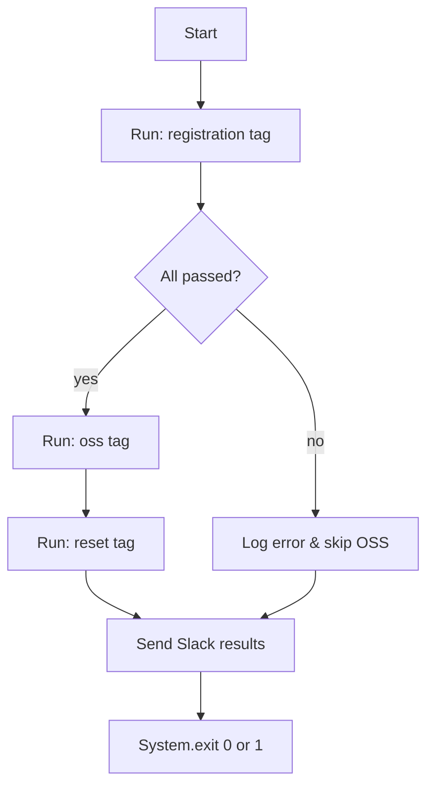

<!-- source-hash: 9eaf0683aaca1611d2848f8c2515cfda -->
The main entry point for the OpenFrame OSS tenant test suite, orchestrating sequential test execution across registration, OSS, and reset phases with Allure reporting and Slack notifications.

## Key Components

| Component | Description |
|---|---|
| `TestApplication.main()` | Drives the full test lifecycle: discover → list → run → summarize |
| `TestRunner` / `TestRunnerConfig` | Configures and executes JUnit Platform test plans |
| `AllureJunitPlatform` | Attaches Allure report generation as a test listener |
| `SummaryGeneratingListener` | Captures pass/fail counts for gate-checking between phases |
| `SlackClient` / `SlackListener` | Posts results to Slack channel `C0AHS6C6G3H` via OAuth token |
| `SummaryLogger` | Logs discovered test lists and execution summaries to stdout |

## Execution Flow



## Usage Example

```bash
# Run full suite (registration → oss → reset)
SLACK_OAUTH_TOKEN=xoxb-... java -cp app.jar com.openframe.test.TestApplication

# Skip registration phase (pass any argument to bypass args.length == 0 check)
SLACK_OAUTH_TOKEN=xoxb-... java -cp app.jar com.openframe.test.TestApplication skip
```

> **Note:** The `SLACK_OAUTH_TOKEN` environment variable must be set before launch. If registration tests fail, OSS and reset phases are skipped and the process exits with code `1`.

## Source

[`TestApplication.java`](https://github.com/flamingo-stack/openframe-oss-tenant/blob/main/src/main/java/com/openframe/test/TestApplication.java)